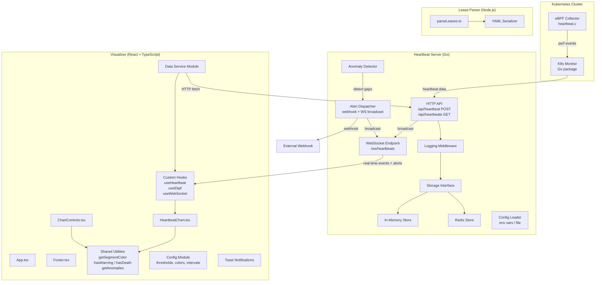

# Design Document: Earthworm Improvements

## Overview

This design covers four improvement areas for the Earthworm Kubernetes heartbeat monitoring system:

1. **Refactoring** — TypeScript migration of the React Visualizer, configuration extraction, separation of concerns (data fetching vs. presentation), and structured error handling in the Go server.
2. **New Features** — WebSocket real-time streaming from the Go server to the Visualizer, a pluggable persistent storage layer (in-memory default, Redis option), and server-side anomaly detection with alerting.
3. **Visualization Enhancements** — Zoom/pan on the cardiogram chart, multi-cluster support, accessibility and responsive layout improvements.
4. **Testing** — Go server unit/integration tests, React component and utility tests, lease parser round-trip verification, and end-to-end data flow tests.

The existing system consists of:
- A Go HTTP server (`src/server/main.go`) with in-memory heartbeat storage and no structured errors.
- A React app (`src/heartbeat-visualizer/`) using plain JS/JSX, Recharts, hardcoded thresholds, and tightly coupled data fetching + rendering in `HeartbeatChart.jsx`.
- A Kubernetes client package (`src/kubernetes/`) with lease monitoring, eBPF correlation, and mock data generation.
- A Node.js lease parser (`parseLeases.js`) that converts YAML to JSON.
- An eBPF C program (`src/ebpf/heartbeat.c`) for intercepting context switches.

No automated tests exist today. The test script in `package.json` is a no-op.

## Architecture



### Key Design Decisions

1. **Storage Interface Pattern** — The Go server defines a `Store` interface so that in-memory and Redis implementations are swappable via config. This avoids coupling the server to any specific backend.
2. **WebSocket for Real-Time** — A single `/ws/heartbeats` endpoint pushes both heartbeat events and alerts. The Visualizer uses a custom `useWebSocket` hook with exponential backoff reconnection.
3. **Anomaly Detection on Server** — Gap detection runs server-side (not just in the UI) so alerts can be dispatched to webhooks regardless of whether a browser is open.
4. **TypeScript Migration** — The Visualizer migrates `.js`/`.jsx` → `.ts`/`.tsx` with strict mode. Shared types live in `src/heartbeat-visualizer/src/types/`.
5. **Separation of Concerns** — A `dataService` module handles all HTTP/WS communication. Custom hooks manage state. Components only render.
6. **Recharts Zoom/Pan** — Implemented via `ReferenceArea` for brush-select zoom and controlled domain state for pan, avoiding a heavy charting library swap.

## Components and Interfaces

### Go Server Components

#### Storage Interface

```go
// store.go
type Store interface {
    Save(ctx context.Context, event Heartbeat) error
    GetByTimeRange(ctx context.Context, from, to time.Time) ([]Heartbeat, error)
    GetLatestByNode(ctx context.Context, nodeName string) (*Heartbeat, error)
    Ping(ctx context.Context) error
}
```

#### In-Memory Store

Default implementation using a mutex-protected slice. Implements `Store`.

#### Redis Store

Uses `go-redis/redis` client. Selected via `EARTHWORM_STORE=redis` env var. Heartbeats stored as sorted sets keyed by node, scored by timestamp.

#### Config Loader

```go
// config.go
type Config struct {
    Port              int      `env:"EARTHWORM_PORT" default:"8080"`
    LogFilePath       string   `env:"EARTHWORM_LOG_FILE" default:"earthworm.log"`
    CORSOrigins       []string `env:"EARTHWORM_CORS_ORIGINS" default:"*"`
    StoreType         string   `env:"EARTHWORM_STORE" default:"memory"`
    RedisAddr         string   `env:"EARTHWORM_REDIS_ADDR" default:"localhost:6379"`
    WarningThresholdS int      `env:"EARTHWORM_WARNING_THRESHOLD" default:"10"`
    CriticalThresholdS int     `env:"EARTHWORM_CRITICAL_THRESHOLD" default:"40"`
    WebhookURL        string   `env:"EARTHWORM_WEBHOOK_URL"`
}
```

#### Anomaly Detector

```go
// anomaly.go
type AnomalyDetector struct {
    store             Store
    warningThreshold  time.Duration
    criticalThreshold time.Duration
    alertCh           chan Alert
}

func (ad *AnomalyDetector) Evaluate(event Heartbeat) *Alert
```

Compares incoming event timestamp against the latest stored event for the same node. Emits an `Alert` if the gap exceeds thresholds.

#### Alert Dispatcher

```go
// alert.go
type Alert struct {
    NodeName  string    `json:"nodeName"`
    Namespace string    `json:"namespace"`
    Gap       float64   `json:"gapSeconds"`
    Severity  string    `json:"severity"` // "warning" | "critical"
    Timestamp time.Time `json:"timestamp"`
}

type AlertDispatcher struct {
    webhookURL string
    wsBroadcast func(Alert)
}

func (d *AlertDispatcher) Dispatch(alert Alert) error
```

#### Logging Middleware

```go
func LoggingMiddleware(next http.Handler) http.Handler
```

Logs method, path, status code, and duration for every request.

#### Structured Error Responses

```go
type ErrorResponse struct {
    Error string `json:"error"`
}

func writeJSONError(w http.ResponseWriter, msg string, status int)
```

All error paths return JSON with an `error` field instead of plain text.

#### WebSocket Hub

```go
// ws.go
type Hub struct {
    clients    map[*Client]bool
    broadcast  chan []byte
    register   chan *Client
    unregister chan *Client
}

func (h *Hub) Run()
func (h *Hub) BroadcastHeartbeat(event Heartbeat)
func (h *Hub) BroadcastAlert(alert Alert)
```

Uses `gorilla/websocket`. Manages client connections and broadcasts.

### Visualizer Components (React + TypeScript)

#### Type Definitions (`src/heartbeat-visualizer/src/types/`)

```typescript
// heartbeat.ts
export interface HeartbeatEvent {
  nodeName: string;
  namespace: string;
  timestamp: number; // epoch ms
  status: 'healthy' | 'unhealthy';
  ebpf?: EbpfMetadata;
}

export interface EbpfMetadata {
  pid: number;
  comm: string;
  syscall: string;
  cgroupPath: string;
}

export interface LeasePoint {
  x: number; // index
  y: number; // timestamp ms
}

export interface LeasesByNamespace {
  [namespace: string]: LeasePoint[];
}

export interface Alert {
  nodeName: string;
  namespace: string;
  gapSeconds: number;
  severity: 'warning' | 'critical';
  timestamp: number;
}

export interface ChartControlsProps {
  noise: boolean;
  onNoiseToggle: () => void;
  language: string;
  onLanguageToggle: () => void;
  onRestart: () => void;
  timestamp: number | null;
  leasesData: LeasesByNamespace | null;
  showEbpf: boolean;
  onEbpfCorrelate: () => void;
  clearEbpfData: () => void;
  restoreEbpfData: () => void;
}
```

#### Config Module (`src/heartbeat-visualizer/src/config.ts`)

```typescript
export const config = {
  heartbeatInterval: 10000,
  warningGapThreshold: 10000,
  criticalGapThreshold: 40000,
  colors: {
    healthy: 'rgb(11, 238, 121)',
    warning: 'rgb(255, 205, 86)',
    critical: 'rgb(255, 99, 132)',
    death: '#e00',
    ebpf: '#ff2050',
  },
  clusterName: 'production-us-west-1',
  wsEndpoint: 'ws://localhost:8080/ws/heartbeats',
  apiBaseUrl: 'http://localhost:8080',
  reconnect: {
    initialDelayMs: 1000,
    maxDelayMs: 30000,
  },
};
```

#### Data Service Module (`src/heartbeat-visualizer/src/services/dataService.ts`)

```typescript
export async function fetchHeartbeats(from?: Date, to?: Date): Promise<HeartbeatEvent[]>
export async function postHeartbeat(event: HeartbeatEvent): Promise<void>
export function transformLeasesForChart(data: LeasesByNamespace, maxPoints: number): ChartDataPoint[]
```

#### Custom Hooks

- `useHeartbeatData()` — Manages lease data loading, animation state, current heartbeat index.
- `useEbpfData()` — Manages eBPF manifest loading and marker computation.
- `useWebSocket(url)` — Connects to WebSocket, handles reconnection with exponential backoff, exposes connection status and incoming messages.

#### Shared Utilities (`src/heartbeat-visualizer/src/utils/`)

Extracted from `HeartbeatChart.jsx` and `ChartControls.jsx`:

```typescript
export function getSegmentColor(data: LeasePoint[], index: number): string
export function hasWarning(data: LeasePoint[]): boolean
export function hasDeath(data: LeasePoint[]): boolean
export function getAnomalies(leasesData: LeasesByNamespace): Anomaly[]
export function formatFullDate(ms: number): string
```

#### Zoom/Pan Support

HeartbeatChart manages `xDomain: [number, number] | null` state. Click-and-drag sets a `ReferenceArea` that updates `xDomain` on mouse-up. A "Reset Zoom" button clears `xDomain` to show the full range. Panning shifts `xDomain` by a delta on drag.

#### Multi-Cluster Support

A `ClusterSelector` component allows switching between clusters (tabs or dropdown). Each cluster's data is fetched independently. The chart renders data for the selected cluster.

#### Accessibility

- Semantic HTML: `<header>`, `<main>`, `<footer>`, `<nav>`.
- ARIA labels on all buttons and toggles.
- Keyboard navigation with visible focus rings.
- Color contrast ≥ 4.5:1 for all text.
- Responsive layout: single-column below 768px, wider above.

### Lease Parser

#### Round-Trip Serializer

```typescript
// parseLeases.ts additions
export function serializeToYaml(data: LeasesByNamespace, originalYaml: any): string
```

Converts the namespaced JSON structure back into a YAML Lease list. Combined with the existing parser, this enables round-trip verification: `parse(yaml) → json → serialize(json) → yaml2 → parse(yaml2)` should produce equivalent JSON.

## Data Models

### Heartbeat (Go)

```go
type Heartbeat struct {
    NodeName  string    `json:"nodeName"`
    Namespace string    `json:"namespace"`
    Timestamp time.Time `json:"timestamp"`
    Status    string    `json:"status"`
    EbpfPID   uint32    `json:"ebpfPid,omitempty"`
    EbpfComm  string    `json:"ebpfComm,omitempty"`
}
```

### Alert (Go)

```go
type Alert struct {
    NodeName  string    `json:"nodeName"`
    Namespace string    `json:"namespace"`
    Gap       float64   `json:"gapSeconds"`
    Severity  string    `json:"severity"`
    Timestamp time.Time `json:"timestamp"`
}
```

### WebSocket Message Envelope

```json
{
  "type": "heartbeat" | "alert" | "status",
  "payload": { ... }
}
```

### Lease Data (Frontend)

```typescript
// Per-namespace array of {x: index, y: timestampMs}
interface LeasesByNamespace {
  [namespace: string]: Array<{ x: number; y: number }>;
}
```

### Redis Storage Schema

- Key pattern: `heartbeat:{nodeName}` — Sorted set, score = Unix timestamp (ms), member = JSON-encoded heartbeat.
- Key pattern: `heartbeat:latest:{nodeName}` — String, JSON of most recent heartbeat for fast anomaly lookups.
- TTL: Configurable, default 7 days.


## Correctness Properties

*A property is a characteristic or behavior that should hold true across all valid executions of a system — essentially, a formal statement about what the system should do. Properties serve as the bridge between human-readable specifications and machine-verifiable correctness guarantees.*

### Property 1: Server config round-trip from environment

*For any* set of valid configuration values (port, log path, CORS origins, store type, thresholds), setting them as environment variables and loading the config should produce a `Config` struct whose fields exactly match the provided values.

**Validates: Requirements 2.1**

### Property 2: Invalid HTTP method returns structured 405

*For any* HTTP method that is not the expected method for a given endpoint (e.g., DELETE, PATCH, PUT on `/api/heartbeat`), the server should return HTTP 405 with a JSON body containing an `error` string field.

**Validates: Requirements 4.1**

### Property 3: Malformed JSON returns structured 400

*For any* request body string that is not valid JSON, POSTing it to `/api/heartbeat` should return HTTP 400 with a JSON body containing an `error` string field describing the parse failure.

**Validates: Requirements 4.2**

### Property 4: Logging middleware captures request metadata

*For any* HTTP request to the server, the log output should contain an entry with the request method, path, response status code, and a non-negative duration value.

**Validates: Requirements 4.3**

### Property 5: WebSocket broadcast of heartbeat events

*For any* valid heartbeat event POSTed to `/api/heartbeat`, all currently connected WebSocket clients on `/ws/heartbeats` should receive a message containing that event's data within 500 milliseconds.

**Validates: Requirements 5.2, 13.2**

### Property 6: Incoming WebSocket event appends to chart data

*For any* heartbeat event received via the WebSocket stream, the Visualizer's chart data array length should increase by exactly one, and the last element should correspond to the received event.

**Validates: Requirements 5.4**

### Property 7: Exponential backoff on WebSocket reconnection

*For any* number of consecutive connection failures `n` (where n ≥ 0), the reconnection delay should equal `min(2^n * 1000, 30000)` milliseconds.

**Validates: Requirements 5.5**

### Property 8: Anomaly detection emits correct severity alerts

*For any* node and any pair of consecutive heartbeat timestamps with gap `g`, the anomaly detector should: emit no alert if `g ≤ warningThreshold`, emit a warning alert if `warningThreshold < g ≤ criticalThreshold`, and emit a critical alert if `g > criticalThreshold`. Each emitted alert must contain the node name, namespace, gap duration in seconds, and the correct severity level.

**Validates: Requirements 7.2, 7.3, 7.5**

### Property 9: Alerts broadcast to WebSocket clients

*For any* alert emitted by the anomaly detector, all connected WebSocket clients should receive a message of type `"alert"` containing the alert payload.

**Validates: Requirements 7.6**

### Property 10: Lease parser round-trip

*For any* valid `leases.yaml` input, parsing it to the namespaced JSON structure, serializing that JSON back to YAML, and parsing the resulting YAML again should produce a JSON structure equivalent to the first parse result.

**Validates: Requirements 10.1, 10.4, 10.5**

### Property 11: Lease parser rejects invalid input

*For any* input that is not a valid YAML Lease list (malformed YAML, missing required fields, empty file), the parser should throw/exit with a descriptive error message.

**Validates: Requirements 10.2**

### Property 12: Lease parser output filename format

*For any* execution of the parser, the generated output filename should match the pattern `leases{YYYYMMDDTHHmmss}.json` where the timestamp portion consists of exactly 15 characters in the specified format.

**Validates: Requirements 10.3**

### Property 13: eBPF event correlation

*For any* list of PodInfo entries and any cgroup path string, `CorrelateEBPFEvent` should return the PodInfo whose CgroupPaths contains the given path, or nil if no match exists. If multiple pods match, the first match is returned.

**Validates: Requirements 11.3**

### Property 14: Mock eBPF event generation count and fields

*For any* positive integer `n` and any non-empty node list, `GenerateMockEBPFEvents(nodes, n)` should return exactly `n` events, each with a non-zero PID, non-empty Comm, non-empty CgroupPath, and non-zero Timestamp.

**Validates: Requirements 11.5**

### Property 15: Heartbeat POST-then-GET round-trip

*For any* valid heartbeat event, POSTing it to `/api/heartbeat` and then GETting `/api/heartbeats` should return a list containing an event with matching nodeName, timestamp, and status.

**Validates: Requirements 11.6, 13.1**

### Property 16: Gap classification (hasWarning and hasDeath)

*For any* array of lease points (with `y` as timestamp in ms), `hasWarning` should return `true` if and only if there exists a consecutive pair with gap in `(10000, 40000)`, and `hasDeath` should return `true` if and only if there exists a consecutive pair with gap `> 40000`.

**Validates: Requirements 12.1, 12.2**

### Property 17: Anomaly detection utility (getAnomalies)

*For any* `LeasesByNamespace` object, `getAnomalies` should return one anomaly entry for each consecutive pair across all namespaces where the gap is in `(10000, 40000)`, with correct namespace, gap value, and timestamps.

**Validates: Requirements 12.3**

### Property 18: Segment color mapping

*For any* pair of consecutive lease point timestamps, `getSegmentColor` should return green (`rgb(11, 238, 121)`) when the gap is ≤ 10 seconds, yellow (`rgb(255, 205, 86)`) when the gap is between 10 and 40 seconds, and red (`rgb(255, 99, 132)`) when the gap exceeds 40 seconds (with the multi-interval critical logic).

**Validates: Requirements 12.4**

## Error Handling

### Go Server

| Scenario | HTTP Status | Response Body | Logging |
|---|---|---|---|
| Invalid HTTP method | 405 | `{"error": "Method not allowed"}` | Logged by middleware |
| Malformed JSON body | 400 | `{"error": "Invalid JSON: <detail>"}` | Logged by middleware |
| Internal processing error | 500 | `{"error": "Internal server error"}` | Full error logged server-side, generic message to client |
| Data store unreachable | 503 | `{"error": "Service unavailable"}` | Store error logged with context |
| WebSocket upgrade failure | 400 | Connection rejected | Logged with client info |
| Webhook delivery failure | N/A (async) | N/A | Error logged, alert still broadcast to WS clients |

### Visualizer

| Scenario | Behavior |
|---|---|
| WebSocket disconnection | Show "Disconnected" indicator, exponential backoff reconnect (1s → 30s cap) |
| HTTP fetch failure | Show error state in UI, retry on next animation cycle |
| Invalid data from server | Log warning to console, skip malformed data points |
| Alert received | Display toast notification with severity color and node name, auto-dismiss after 10s |

### Lease Parser

| Scenario | Behavior |
|---|---|
| Missing leases.yaml | Exit with error message and non-zero exit code |
| Malformed YAML | Exit with parse error description and non-zero exit code |
| Missing required fields | Exit with validation error and non-zero exit code |
| Write permission denied | Exit with filesystem error and non-zero exit code |

## Testing Strategy

### Dual Testing Approach

This project uses both unit/example tests and property-based tests:

- **Unit tests** verify specific examples, edge cases, error conditions, and rendering behavior.
- **Property-based tests** verify universal properties across randomly generated inputs with minimum 100 iterations per property.

Both are complementary: unit tests catch concrete bugs and verify specific scenarios, property tests verify general correctness across the input space.

### Go Server Tests

**Framework**: Go standard `testing` package + `net/http/httptest`
**Property-based testing library**: `pgregory.net/rapid`

**Unit tests** (example-based):
- POST handler: valid heartbeat → 201, verify stored
- POST handler: malformed JSON → 400 with JSON error
- POST handler: wrong method (GET) → 405 with JSON error
- GET handler: empty store → 200 with `[]`
- GET handler: populated store → 200 with correct data
- Internal error → 500 with generic message
- Store unreachable → 503
- WebSocket endpoint accepts connection
- Store connectivity check on startup
- Webhook delivery with mock server

**Property tests**:
- Property 1: Config loading from env vars (tag: `Feature: earthworm-improvements, Property 1: Server config round-trip from environment`)
- Property 2: Invalid method → 405 (tag: `Feature: earthworm-improvements, Property 2: Invalid HTTP method returns structured 405`)
- Property 3: Malformed JSON → 400 (tag: `Feature: earthworm-improvements, Property 3: Malformed JSON returns structured 400`)
- Property 4: Logging middleware (tag: `Feature: earthworm-improvements, Property 4: Logging middleware captures request metadata`)
- Property 5: WS broadcast (tag: `Feature: earthworm-improvements, Property 5: WebSocket broadcast of heartbeat events`)
- Property 8: Anomaly detection (tag: `Feature: earthworm-improvements, Property 8: Anomaly detection emits correct severity alerts`)
- Property 9: Alert WS broadcast (tag: `Feature: earthworm-improvements, Property 9: Alerts broadcast to WebSocket clients`)
- Property 13: eBPF correlation (tag: `Feature: earthworm-improvements, Property 13: eBPF event correlation`)
- Property 14: Mock event generation (tag: `Feature: earthworm-improvements, Property 14: Mock eBPF event generation count and fields`)
- Property 15: POST-then-GET round-trip (tag: `Feature: earthworm-improvements, Property 15: Heartbeat POST-then-GET round-trip`)

### Visualizer Tests

**Framework**: Jest + React Testing Library (already in `package.json`)
**Property-based testing library**: `fast-check`

**Unit tests** (example-based):
- TypeScript compilation produces zero errors
- HeartbeatChart renders chart elements with mock data
- ChartControls renders all buttons and responds to clicks
- App component renders header, chart, and footer
- Semantic HTML elements present (header, main, footer)
- ARIA labels on interactive controls
- Connection status indicator shows "Disconnected" when WS is down
- Alert toast renders with severity and node name
- Zoom/pan: brush selection narrows domain, reset restores full range
- Multi-cluster tabs render

**Property tests**:
- Property 6: WS event appends to chart (tag: `Feature: earthworm-improvements, Property 6: Incoming WebSocket event appends to chart data`)
- Property 7: Exponential backoff (tag: `Feature: earthworm-improvements, Property 7: Exponential backoff on WebSocket reconnection`)
- Property 16: hasWarning/hasDeath (tag: `Feature: earthworm-improvements, Property 16: Gap classification (hasWarning and hasDeath)`)
- Property 17: getAnomalies (tag: `Feature: earthworm-improvements, Property 17: Anomaly detection utility (getAnomalies)`)
- Property 18: getSegmentColor (tag: `Feature: earthworm-improvements, Property 18: Segment color mapping`)

### Lease Parser Tests

**Framework**: Jest
**Property-based testing library**: `fast-check`

**Unit tests** (example-based):
- Parse known leases.yaml produces expected structure
- Invalid YAML throws descriptive error
- Missing file throws descriptive error

**Property tests**:
- Property 10: Round-trip (tag: `Feature: earthworm-improvements, Property 10: Lease parser round-trip`)
- Property 11: Invalid input rejection (tag: `Feature: earthworm-improvements, Property 11: Lease parser rejects invalid input`)
- Property 12: Filename format (tag: `Feature: earthworm-improvements, Property 12: Lease parser output filename format`)

### End-to-End Tests

**Framework**: Go `testing` + `net/http/httptest` + `gorilla/websocket` client for server-side E2E; Jest + mock WS for Visualizer E2E.

- POST heartbeat → GET returns it (covered by Property 15)
- POST heartbeat → WS client receives it (covered by Property 5)
- Visualizer renders data point from mocked WS stream (example test)

### Configuration

- All property tests run with minimum **100 iterations**
- Each property test is tagged with a comment: `Feature: earthworm-improvements, Property {N}: {title}`
- Each property test must reference exactly one correctness property from this design document
