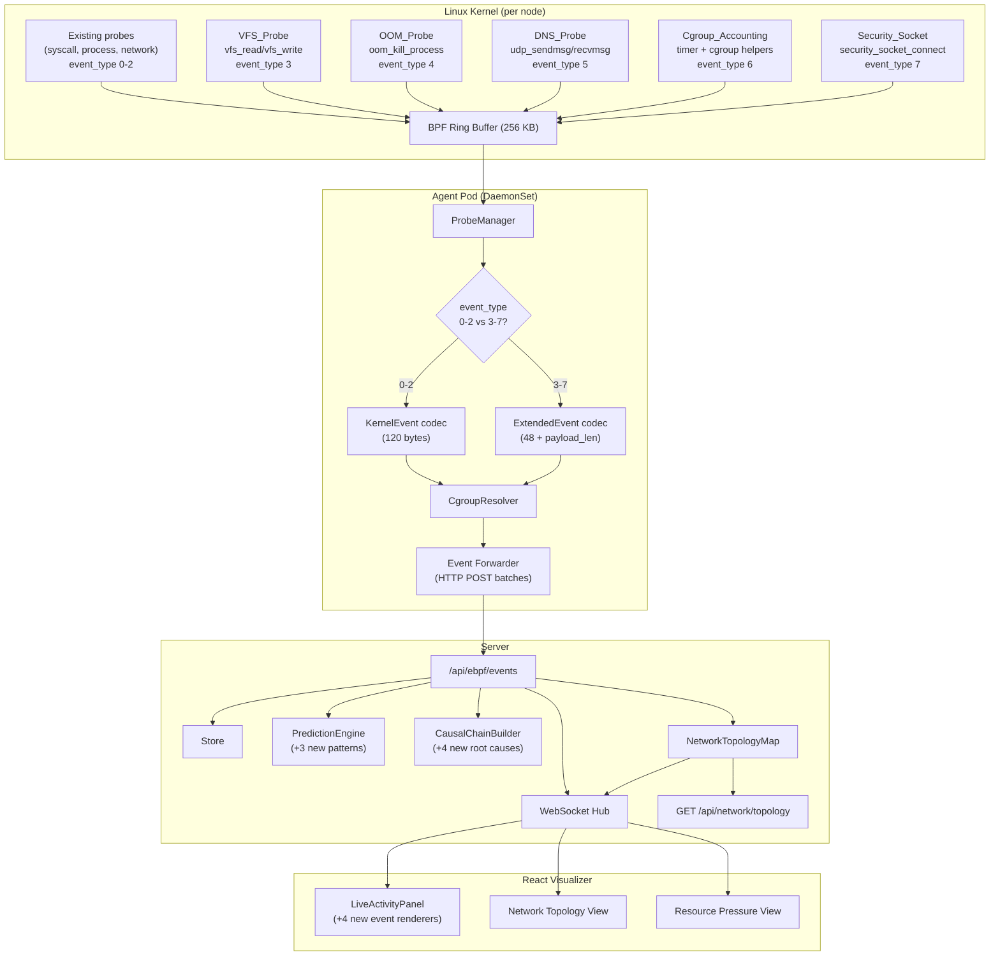

# Design Document: eBPF Advanced Probes

## Overview

This design extends the Earthworm eBPF observability platform with six new probe categories that generate event types 3–8. The existing 120-byte `kernel_event` struct (types 0–2) is preserved unchanged. New probes use a variable-length `extended_event` binary format sharing the same 48-byte common header but carrying probe-specific payloads via a `payload_len` field at offset 48.

The six new probes are:

| Type | Name | Hook Point | Purpose |
|------|------|-----------|---------|
| 3 | VFS_Probe | `vfs_read`/`vfs_write` kprobes | File system I/O latency tracing |
| 4 | OOM_Probe | `oom_kill_process` kprobe + `mm_page_alloc` tracepoint | Memory pressure signals |
| 5 | DNS_Probe | `udp_sendmsg`/`udp_recvmsg` kprobes | DNS resolution tracing |
| 6 | Cgroup_Accounting_Probe | BPF cgroup helpers (timer-driven) | Per-pod CPU/memory metrics |
| 7 | Security_Socket_Probe | `security_socket_connect` kprobe/LSM | Network policy auditing |

All events flow through the existing pipeline:

```
BPF ring buffer → Agent (decode → enrich → batch) → Server /api/ebpf/events
  → Store + WebSocket broadcast → React Visualizer
```

The ProbeManager dispatches to the correct codec based on `event_type`: types 0–2 use the existing 120-byte `KernelEvent` codec, types 3–7 use the new `ExtendedEvent` codec. All Go-level logic (codec, enrichment, prediction patterns, topology map) compiles and tests on macOS. Only BPF C compilation and loading require Linux 5.8+.

## Architecture



### Platform Separation Strategy

| Concern | macOS (dev) | Linux (prod) |
|---|---|---|
| ExtendedEvent codec | Compiles and tests natively | Same code |
| New prediction patterns | Pure Go, tests natively | Same code |
| NetworkTopologyMap | Pure Go, tests natively | Same code |
| New BPF C programs | Not compiled | `bpf2go` via `go generate` |
| `loader_stub.go` | Updated with event type constants 3–7 | N/A (uses `loader_linux.go`) |
| Agent startup | Logs "eBPF not supported", continues | Loads all programs |

## Components and Interfaces

### 1. ExtendedEvent Binary Format (`src/agent/extended_event.go`)

The ExtendedEvent shares the first 48 bytes with KernelEvent (same field layout through `event_type`), then diverges:

```
Offset  Field            Type       Size
──────  ───────────────  ─────────  ────
  0     timestamp        u64        8
  8     pid              u32        4
 12     ppid             u32        4
 16     tgid             u32        4
 20     [padding]                   4
 24     cgroup_id        u64        8
 32     comm             char[16]   16
 48     event_type       u8         1
 49     [padding]                   1
 50     payload_len      u16        2
 52     payload          byte[]     variable (payload_len bytes)
──────                              ────
Total: 52 + payload_len bytes
```

The Go struct:

```go
type ExtendedEvent struct {
    // Common header (same as KernelEvent bytes 0-48)
    Timestamp  uint64
    PID        uint32
    PPID       uint32
    TGID       uint32
    CgroupID   uint64
    Comm       [TaskCommLen]byte
    EventType  uint8
    PayloadLen uint16
    Payload    []byte // probe-specific, length = PayloadLen
}
```

`MarshalBinary` writes the 52-byte header + payload. `UnmarshalBinary` reads the header, validates `len(data) >= 52 + payload_len`, then copies the payload.

### 2. Probe-Specific Payloads

Each probe type defines a fixed-layout payload struct that is serialized into `ExtendedEvent.Payload`:

#### VFS_Probe Payload (event_type 3)

```go
type VFSPayload struct {
    FilePath    [256]byte // null-terminated path from bpf_d_path
    LatencyNs   uint64   // vfs operation duration
    BytesXfer   uint64   // bytes read/written
    SlowIO      uint8    // 1 if latency > Slow_IO_Threshold
    OpType      uint8    // 0=read, 1=write
}
// Size: 256 + 8 + 8 + 1 + 1 + 6 padding = 280 bytes
```

#### OOM_Probe Payload (event_type 4)

```go
type OOMPayload struct {
    SubType     uint8    // 0=oom_kill, 1=alloc_failure
    KilledPID   uint32   // PID of killed process (sub_type 0)
    KilledComm  [16]byte // comm of killed process
    OOMScoreAdj int32    // OOM score adjustment (-1 if unreadable)
    PageOrder   uint32   // requested page order (sub_type 1)
    GFPFlags    uint32   // GFP flags (sub_type 1)
}
// Size: 1 + 3 padding + 4 + 16 + 4 + 4 + 4 = 36 bytes
```

#### DNS_Probe Payload (event_type 5)

```go
type DNSPayload struct {
    Domain      [253]byte // query domain name, null-terminated
    LatencyNs   uint64    // response time
    ResponseCode uint16   // DNS RCODE
    TimedOut    uint8     // 1 if no response within threshold
}
// Size: 253 + 3 padding + 8 + 2 + 1 + 1 padding = 268 bytes
```

#### Cgroup_Accounting Payload (event_type 6)

```go
type CgroupResourcePayload struct {
    CPUUsageNs      uint64 // cumulative CPU nanoseconds
    MemoryUsageBytes uint64 // current RSS
    MemoryLimitBytes uint64 // cgroup memory limit
    MemoryPressure  uint8  // 1 if RSS > 90% of limit
}
// Size: 8 + 8 + 8 + 1 + 7 padding = 32 bytes
```

#### Security_Socket Payload (event_type 7)

```go
type NetworkAuditPayload struct {
    DstAddr   uint32 // IPv4 destination
    DstPort   uint16 // destination port
    Protocol  uint8  // 6=TCP, 17=UDP
}
// Size: 4 + 2 + 1 + 1 padding = 8 bytes
```

### 3. ProbeManager Dispatch (`src/agent/probe_manager.go`)

The existing `ProcessRawEvent` method is extended with a dispatch check:

```go
func (pm *ProbeManager) ProcessRawEvent(data []byte) error {
    if len(data) < 49 {
        return fmt.Errorf("record too short: %d bytes", len(data))
    }
    eventType := data[48]
    if eventType <= 2 {
        return pm.processKernelEvent(data)
    }
    return pm.processExtendedEvent(data)
}
```

### 4. EnrichedEvent Extensions (`src/agent/event.go`, `src/server/kernel_event.go`)

The existing `EnrichedEvent` struct gains new optional fields for each probe type:

```go
// Filesystem I/O fields (event_type "filesystem_io")
FilePath    string `json:"filePath,omitempty"`
IOLatencyNs uint64 `json:"ioLatencyNs,omitempty"`
BytesXfer   uint64 `json:"bytesXfer,omitempty"`
SlowIO      bool   `json:"slowIO,omitempty"`
IOOpType    string `json:"ioOpType,omitempty"` // "read" or "write"

// Memory pressure fields (event_type "memory_pressure")
OOMSubType  string `json:"oomSubType,omitempty"` // "oom_kill" or "alloc_failure"
KilledPID   uint32 `json:"killedPid,omitempty"`
KilledComm  string `json:"killedComm,omitempty"`
OOMScoreAdj int32  `json:"oomScoreAdj,omitempty"`
PageOrder   uint32 `json:"pageOrder,omitempty"`
GFPFlags    uint32 `json:"gfpFlags,omitempty"`

// DNS resolution fields (event_type "dns_resolution")
Domain       string `json:"domain,omitempty"`
DNSLatencyNs uint64 `json:"dnsLatencyNs,omitempty"`
ResponseCode uint16 `json:"responseCode,omitempty"`
TimedOut     bool   `json:"timedOut,omitempty"`

// Cgroup resource fields (event_type "cgroup_resource")
CPUUsageNs       uint64 `json:"cpuUsageNs,omitempty"`
MemoryUsageBytes uint64 `json:"memoryUsageBytes,omitempty"`
MemoryLimitBytes uint64 `json:"memoryLimitBytes,omitempty"`
MemoryPressure   bool   `json:"memoryPressure,omitempty"`

// Network audit fields (event_type "network_audit")
AuditDstAddr  string `json:"auditDstAddr,omitempty"`
AuditDstPort  uint16 `json:"auditDstPort,omitempty"`
AuditProtocol string `json:"auditProtocol,omitempty"` // "tcp" or "udp"
```

### 5. PredictionEngine Enhancements (`src/server/prediction.go`)

Three new pattern detectors are added alongside the existing four:

```go
// New patterns
func detectFilesystemIODegradation(events []EnrichedEvent) float64
func detectMemoryPressureEscalation(events []EnrichedEvent) float64
func detectDNSResolutionDegradation(events []EnrichedEvent) float64
```

The `Analyze` method calls all seven detectors. When ≥3 distinct patterns fire simultaneously, a minimum confidence of 0.7 is enforced.

### 6. CausalChainBuilder Enhancements (`src/server/causal_chain.go`)

`detectRootCause` gains four new root cause categories checked before the existing ones:

1. `oom_kill` — OOM_Probe events with sub_type 0
2. `filesystem_io_bottleneck` — VFS_Probe events with `slow_io` flag
3. `dns_timeout` — DNS_Probe events with `timed_out` flag
4. `network_policy_violation` — Security_Socket_Probe events (informational)

`generateSummary` includes counts for each new event type.

### 7. NetworkTopologyMap (`src/server/network_topology.go`)

A new server-side data structure:

```go
type ConnectionRecord struct {
    SourcePod   string    `json:"sourcePod"`
    SourceNS    string    `json:"sourceNamespace"`
    DstAddr     string    `json:"dstAddr"`
    DstPort     uint16    `json:"dstPort"`
    Protocol    string    `json:"protocol"`
    LastSeen    time.Time `json:"lastSeen"`
    NodeName    string    `json:"nodeName"`
}

type NetworkTopologyMap struct {
    mu          sync.RWMutex
    connections map[string]*ConnectionRecord // key: "pod|ns|ip|port|proto"
    window      time.Duration
}
```

Methods: `Record(event EnrichedEvent)`, `Expire()`, `Connections() []ConnectionRecord`.

Exposed via `GET /api/network/topology`. New connections broadcast as `network_topology_update` WebSocket messages.

### 8. BPF C Programs

Five new C files in `src/ebpf/`:

| File | Hook | SEC annotation |
|------|------|---------------|
| `vfs_probe.c` | `vfs_read`, `vfs_write` | `kprobe/vfs_read`, `kretprobe/vfs_read`, etc. |
| `oom_probe.c` | `oom_kill_process`, `mm_page_alloc` | `kprobe/oom_kill_process`, `tracepoint/kmem/mm_page_alloc` |
| `dns_probe.c` | `udp_sendmsg`, `udp_recvmsg` | `kprobe/udp_sendmsg`, `kprobe/udp_recvmsg` |
| `cgroup_accounting.c` | BPF timer + cgroup helpers | `tp_btf/cgroup_attach_task` (trigger) |
| `security_socket.c` | `security_socket_connect` | `kprobe/security_socket_connect` |

All programs use the shared `events` ring buffer from `common.h`. The `extended_event` C struct is defined in a new `src/ebpf/headers/extended_common.h` header.

### 9. Visualizer Extensions (`src/heartbeat-visualizer/`)

New TypeScript types in `src/types/heartbeat.ts`:

```typescript
export interface FilesystemIOEvent extends EnrichedKernelEvent {
  eventType: 'filesystem_io';
  filePath: string;
  ioLatencyNs: number;
  bytesXfer: number;
  slowIO: boolean;
  ioOpType: 'read' | 'write';
}

export interface MemoryPressureEvent extends EnrichedKernelEvent {
  eventType: 'memory_pressure';
  oomSubType: 'oom_kill' | 'alloc_failure';
  killedPid?: number;
  killedComm?: string;
  oomScoreAdj?: number;
  pageOrder?: number;
  gfpFlags?: number;
}

export interface DNSResolutionEvent extends EnrichedKernelEvent {
  eventType: 'dns_resolution';
  domain: string;
  dnsLatencyNs: number;
  responseCode: number;
  timedOut: boolean;
}

export interface CgroupResourceEvent extends EnrichedKernelEvent {
  eventType: 'cgroup_resource';
  cpuUsageNs: number;
  memoryUsageBytes: number;
  memoryLimitBytes: number;
  memoryPressure: boolean;
}

export interface NetworkAuditEvent extends EnrichedKernelEvent {
  eventType: 'network_audit';
  auditDstAddr: string;
  auditDstPort: number;
  auditProtocol: 'tcp' | 'udp';
}
```

Two new view options added to `ViewSelector`:
- `'network-topology'` — renders `ConnectionRecord[]` from `/api/network/topology`
- `'resource-pressure'` — renders per-pod CPU/memory from cgroup_resource events

The `LiveActivityPanel` gains renderers for each new event type, showing relevant fields (file path + latency for filesystem_io, killed process for memory_pressure, domain + response time for dns_resolution, etc.).

### 10. Configuration (`src/agent/config.go`)

New environment variables with defaults and validation:

| Variable | Default | Valid Range |
|----------|---------|-------------|
| `EARTHWORM_SLOW_IO_THRESHOLD_MS` | 100 | 1–60000 |
| `EARTHWORM_DNS_TIMEOUT_MS` | 5000 | 100–60000 |
| `EARTHWORM_CGROUP_SAMPLE_INTERVAL_S` | 10 | 1–3600 |
| `EARTHWORM_TOPOLOGY_WINDOW_S` | 300 | 10–86400 |
| `EARTHWORM_MEMORY_PRESSURE_PCT` | 90 | 1–100 |

Out-of-range values log a warning and fall back to defaults. BPF-side thresholds are pushed to BPF maps at startup and can be updated at runtime without reloading programs.

## Data Models

### ExtendedEvent Binary Layout (C)

Defined in `src/ebpf/headers/extended_common.h`:

```c
struct extended_event {
    /* Common header — identical layout to kernel_event bytes 0-48 */
    __u64 timestamp;
    __u32 pid;
    __u32 ppid;
    __u32 tgid;
    __u64 cgroup_id;
    char  comm[TASK_COMM_LEN];
    __u8  event_type;       /* 3-7 for extended events */
    __u8  _pad;
    __u16 payload_len;      /* length of payload[] */
    __u8  payload[];        /* flexible array member */
};
```

### Payload Layouts (C)

```c
/* event_type 3: VFS I/O */
struct vfs_payload {
    char  file_path[256];
    __u64 latency_ns;
    __u64 bytes_xfer;
    __u8  slow_io;
    __u8  op_type;          /* 0=read, 1=write */
};

/* event_type 4: OOM / alloc failure */
struct oom_payload {
    __u8  sub_type;         /* 0=oom_kill, 1=alloc_failure */
    __u32 killed_pid;
    char  killed_comm[16];
    __s32 oom_score_adj;    /* -1 if unreadable */
    __u32 page_order;
    __u32 gfp_flags;
};

/* event_type 5: DNS resolution */
struct dns_payload {
    char  domain[253];
    __u64 latency_ns;
    __u16 response_code;
    __u8  timed_out;
};

/* event_type 6: Cgroup resource accounting */
struct cgroup_resource_payload {
    __u64 cpu_usage_ns;
    __u64 memory_usage_bytes;
    __u64 memory_limit_bytes;
    __u8  memory_pressure;
};

/* event_type 7: Network audit */
struct network_audit_payload {
    __u32 dst_addr;
    __u16 dst_port;
    __u8  protocol;         /* IPPROTO_TCP=6, IPPROTO_UDP=17 */
};
```

### EnrichedEvent JSON (extended)

The existing `EnrichedEvent` JSON schema is extended with optional fields for each new event type. The `eventType` field uses string values: `"filesystem_io"`, `"memory_pressure"`, `"dns_resolution"`, `"cgroup_resource"`, `"network_audit"`. Unrecognized event types are persisted as-is.

### NetworkTopologyMap

```json
{
  "sourcePod": "coredns-abc123",
  "sourceNamespace": "kube-system",
  "dstAddr": "10.0.0.5",
  "dstPort": 443,
  "protocol": "tcp",
  "lastSeen": "2025-01-15T10:30:00Z",
  "nodeName": "node-01"
}
```

### WebSocket Message Types

Existing types unchanged. New additions:

```json
{ "type": "network_topology_update", "payload": { /* ConnectionRecord */ } }
```

All new event types use the existing `"ebpf_event"` WebSocket message type.


## Correctness Properties

*A property is a characteristic or behavior that should hold true across all valid executions of a system — essentially, a formal statement about what the system should do. Properties serve as the bridge between human-readable specifications and machine-verifiable correctness guarantees.*

### Property 1: ExtendedEvent binary round-trip

*For any* valid ExtendedEvent with event_type in {3, 4, 5, 6, 7} and any probe-specific payload of the correct length for that event type, encoding via `MarshalBinary` then decoding via `UnmarshalBinary` shall produce an ExtendedEvent identical to the original across all header fields (timestamp, pid, ppid, tgid, cgroup_id, comm, event_type, payload_len) and the entire payload byte slice. The first 48 bytes of the encoded buffer shall match the layout of a KernelEvent's common header for the same field values.

**Validates: Requirements 1.1, 1.2, 1.5, 1.6**

### Property 2: ProbeManager dispatch correctness

*For any* raw byte buffer of sufficient length with a valid event_type byte at offset 48, the ProbeManager shall route to the KernelEvent codec when event_type is in {0, 1, 2} and to the ExtendedEvent codec when event_type is in {3, 4, 5, 6, 7}. The dispatch decision shall depend solely on the event_type byte and no other field.

**Validates: Requirements 1.3, 1.4**

### Property 3: EnrichedEvent JSON round-trip with extended fields

*For any* valid EnrichedEvent containing fields from any of the new event types (filesystem_io, memory_pressure, dns_resolution, cgroup_resource, network_audit), serializing to JSON via `json.Marshal` and deserializing back via `json.Unmarshal` shall produce an EnrichedEvent equivalent to the original across all fields including the new probe-specific fields.

**Validates: Requirements 9.4, 5.6**

### Property 4: Cgroup resolution for extended events

*For any* ExtendedEvent and any CgroupResolver cache state: if the event's cgroup ID is present in the cache, enrichment shall return the cached PodIdentity with `hostLevel` false and all pod identity fields populated; if the cgroup ID is absent, enrichment shall return `hostLevel` true with only nodeName populated. This shall hold for all event types including the new types 3–7.

**Validates: Requirements 5.5, 5.7**

### Property 5: Prediction confidence invariants

*For any* sequence of EnrichedEvents (mixing old types 0–2 and new types 3–7) analyzed by the PredictionEngine: (a) the resulting confidence shall be in the range [0.0, 1.0], (b) every pattern that fires shall appear in the `patterns` list, and (c) when three or more distinct pattern types are detected, the confidence shall be at least 0.7.

**Validates: Requirements 6.5, 6.6, 6.7**

### Property 6: Filesystem I/O degradation detection

*For any* sequence of EnrichedEvents where the filesystem_io events have monotonically increasing `ioLatencyNs` values across at least 3 events, the `detectFilesystemIODegradation` function shall return a positive score. *For any* sequence with no filesystem_io events, it shall return 0.

**Validates: Requirements 6.2**

### Property 7: Memory pressure escalation detection

*For any* sequence of EnrichedEvents containing at least one OOM kill event (oomSubType "oom_kill") or containing sustained memory_pressure flags from cgroup_resource events, the `detectMemoryPressureEscalation` function shall return a positive score. *For any* sequence with no memory-related events, it shall return 0.

**Validates: Requirements 6.3**

### Property 8: DNS resolution degradation detection

*For any* sequence of EnrichedEvents where dns_resolution events have monotonically increasing `dnsLatencyNs` values across at least 3 events, or where any dns_resolution event has `timedOut` true, the `detectDNSResolutionDegradation` function shall return a positive score. *For any* sequence with no dns_resolution events, it shall return 0.

**Validates: Requirements 6.4**

### Property 9: NetworkTopologyMap record and expire

*For any* sequence of ConnectionRecord insertions into a NetworkTopologyMap with a configured window W: (a) after recording, all inserted records with lastSeen within the window shall be present in `Connections()`, and (b) after calling `Expire()`, all records with lastSeen older than W shall be absent from `Connections()` while records within the window shall remain.

**Validates: Requirements 7.4, 7.7**

### Property 10: NetworkTopologyMap broadcast on new connection

*For any* NetworkTopologyMap, recording a connection tuple that is not already present shall trigger a broadcast notification. Recording a connection tuple that is already present (duplicate) shall not trigger a broadcast, only update the lastSeen timestamp.

**Validates: Requirements 7.6**

### Property 11: Causal chain completeness with new event types

*For any* set of stored EnrichedEvents spanning event types 0–7 within a 120-second window before a NotReady transition, the CausalChainBuilder shall include all events in the chain regardless of event type. The generated summary shall contain a count for each event type that has at least one event in the chain.

**Validates: Requirements 8.1, 8.5**

### Property 12: Causal chain root cause detection for new types

*For any* set of EnrichedEvents in a causal chain: if OOM kill events (oomSubType "oom_kill") are present, the root cause shall be "oom_kill"; if slow VFS events (slowIO true) are present and no OOM kills, the root cause shall be "filesystem_io_bottleneck"; if DNS timeout events (timedOut true) are present and no higher-priority causes, the root cause shall be "dns_timeout". The priority order is: critical_exit > oom_kill > filesystem_io_bottleneck > dns_timeout > slow_syscall > network_degradation > unknown_cause.

**Validates: Requirements 8.2, 8.3, 8.4**

### Property 13: Server ingestion and broadcast for extended events

*For any* valid JSON array of EnrichedEvents containing new event types POSTed to `/api/ebpf/events`, the server shall persist every event to the store and broadcast every event to connected WebSocket clients using the `ebpf_event` message type. The count of persisted and broadcast events shall equal the input array length.

**Validates: Requirements 9.1, 9.3**

### Property 14: Configuration validation with defaults

*For any* configuration parameter value: if the value is within the valid range, the parsed configuration shall use that value; if the value is outside the valid range (including negative, zero where invalid, or exceeding maximum), the parsed configuration shall use the documented default value. This shall hold for all five new parameters (SLOW_IO_THRESHOLD_MS, DNS_TIMEOUT_MS, CGROUP_SAMPLE_INTERVAL_S, TOPOLOGY_WINDOW_S, MEMORY_PRESSURE_PCT).

**Validates: Requirements 12.1, 12.2, 12.4**

## Error Handling

### ExtendedEvent Codec Errors

| Error Condition | Behavior |
|---|---|
| Buffer shorter than 52 bytes (minimum header) | `UnmarshalBinary` returns error with actual vs expected size |
| Buffer shorter than 52 + payload_len | `UnmarshalBinary` returns error with actual vs expected size |
| Unknown event_type in ExtendedEvent | Codec decodes header + raw payload; enrichment labels event type as-is |

### BPF Probe Loading Errors (Linux only)

| Error Condition | Behavior |
|---|---|
| `bpf_d_path()` fails in VFS_Probe | File path set to empty string, event still emitted |
| OOM score unreadable in OOM_Probe | OOM score set to -1, event still emitted |
| DNS domain unparseable in DNS_Probe | Domain set to empty string, event still emitted |
| Hook point unavailable (kernel too old) | Log warning, skip that probe, continue with others |

### PredictionEngine Errors

| Error Condition | Behavior |
|---|---|
| Empty event list | `Analyze` returns nil (no prediction) |
| All pattern scores are 0 | `Analyze` returns nil (no prediction) |
| Events contain unknown event types | Ignored by pattern detectors, no error |

### NetworkTopologyMap Errors

| Error Condition | Behavior |
|---|---|
| Event missing pod identity (host-level) | Record with empty sourcePod, still tracked |
| Concurrent access | Protected by `sync.RWMutex` |
| Expiration during read | RLock for reads, Lock for expire — no data races |

### CausalChainBuilder Errors

| Error Condition | Behavior |
|---|---|
| No events in 120s window | Summary says "no correlated kernel events", root cause "unknown_cause" |
| Store query failure | Return error, do not build partial chain |
| Mixed old and new event types | All included in chain, summary counts all types |

### Server Ingestion Errors

| Error Condition | Behavior |
|---|---|
| Unrecognized event type string | Log warning, persist event as-is (Req 9.2) |
| Invalid JSON body | Return HTTP 400 with error message |
| Store persistence failure for one event | Log error, continue with remaining events |

### Configuration Errors

| Error Condition | Behavior |
|---|---|
| Out-of-range parameter value | Log warning, use default value (Req 12.2) |
| Non-numeric environment variable | Log warning, use default value |
| Missing environment variable | Use default value silently |

## Testing Strategy

### Dual Testing Approach

This feature uses both unit/example tests and property-based tests. Property-based tests use `pgregory.net/rapid` (Go, already in `go.mod`) with a minimum of 100 iterations per property. TypeScript tests use `fast-check` for any property tests on the visualizer side.

### Property-Based Tests (Go, `pgregory.net/rapid`)

Each property test references its design document property via a comment tag.

| Property | Test Function | Tag | Platform |
|---|---|---|---|
| Property 1: ExtendedEvent binary round-trip | `TestExtendedEventBinaryRoundTrip` | Feature: ebpf-advanced-probes, Property 1: ExtendedEvent binary round-trip | macOS + Linux |
| Property 2: ProbeManager dispatch correctness | `TestProbeManagerDispatch` | Feature: ebpf-advanced-probes, Property 2: ProbeManager dispatch correctness | macOS + Linux |
| Property 3: EnrichedEvent JSON round-trip (extended) | `TestEnrichedEventExtendedJSONRoundTrip` | Feature: ebpf-advanced-probes, Property 3: EnrichedEvent JSON round-trip with extended fields | macOS + Linux |
| Property 4: Cgroup resolution for extended events | `TestCgroupResolutionExtendedEvents` | Feature: ebpf-advanced-probes, Property 4: Cgroup resolution for extended events | macOS + Linux |
| Property 5: Prediction confidence invariants | `TestPredictionConfidenceInvariants` | Feature: ebpf-advanced-probes, Property 5: Prediction confidence invariants | macOS + Linux |
| Property 6: Filesystem I/O degradation detection | `TestFilesystemIODegradationDetection` | Feature: ebpf-advanced-probes, Property 6: Filesystem I/O degradation detection | macOS + Linux |
| Property 7: Memory pressure escalation detection | `TestMemoryPressureEscalationDetection` | Feature: ebpf-advanced-probes, Property 7: Memory pressure escalation detection | macOS + Linux |
| Property 8: DNS resolution degradation detection | `TestDNSResolutionDegradationDetection` | Feature: ebpf-advanced-probes, Property 8: DNS resolution degradation detection | macOS + Linux |
| Property 9: NetworkTopologyMap record and expire | `TestNetworkTopologyMapRecordExpire` | Feature: ebpf-advanced-probes, Property 9: NetworkTopologyMap record and expire | macOS + Linux |
| Property 10: NetworkTopologyMap broadcast on new | `TestNetworkTopologyMapBroadcast` | Feature: ebpf-advanced-probes, Property 10: NetworkTopologyMap broadcast on new connection | macOS + Linux |
| Property 11: Causal chain completeness | `TestCausalChainCompleteness` | Feature: ebpf-advanced-probes, Property 11: Causal chain completeness with new event types | macOS + Linux |
| Property 12: Causal chain root cause detection | `TestCausalChainRootCauseNewTypes` | Feature: ebpf-advanced-probes, Property 12: Causal chain root cause detection for new types | macOS + Linux |
| Property 13: Server ingestion extended events | `TestServerIngestionExtendedEvents` | Feature: ebpf-advanced-probes, Property 13: Server ingestion and broadcast for extended events | macOS + Linux |
| Property 14: Configuration validation | `TestConfigurationValidation` | Feature: ebpf-advanced-probes, Property 14: Configuration validation with defaults | macOS + Linux |

Each property-based test must:
- Run a minimum of 100 iterations (rapid's default)
- Include a comment tag: `// Feature: ebpf-advanced-probes, Property {N}: {title}`
- Be implemented as a single `rapid.Check` call per property

### Unit / Example Tests

| Test | What it verifies | Platform |
|---|---|---|
| `TestExtendedEventShortBuffer` | UnmarshalBinary rejects buffers < 52 bytes (Req 1.7) | macOS + Linux |
| `TestExtendedEventPayloadTruncated` | UnmarshalBinary rejects buffer where len < 52 + payload_len (Req 1.7) | macOS + Linux |
| `TestVFSPayloadMarshal` | VFS payload struct marshals to expected byte layout | macOS + Linux |
| `TestOOMPayloadMarshal` | OOM payload struct marshals to expected byte layout | macOS + Linux |
| `TestDNSPayloadMarshal` | DNS payload struct marshals to expected byte layout | macOS + Linux |
| `TestCgroupResourcePayloadMarshal` | Cgroup resource payload marshals to expected byte layout | macOS + Linux |
| `TestNetworkAuditPayloadMarshal` | Network audit payload marshals to expected byte layout | macOS + Linux |
| `TestPredictionMinConfidenceThreePatterns` | Specific example: 3 patterns → confidence ≥ 0.7 (Req 6.7) | macOS + Linux |
| `TestNetworkTopologyEndpoint` | GET /api/network/topology returns correct JSON (Req 7.5) | macOS + Linux |
| `TestServerUnrecognizedEventType` | POST with unknown event type persists and logs warning (Req 9.2) | macOS + Linux |
| `TestStubLoaderExtendedConstants` | loader_stub.go exports event type constants 3–7 (Req 11.5) | macOS |
| `TestConfigDefaultValues` | All config params have correct defaults when env vars unset (Req 12.1) | macOS + Linux |
| `TestBPFProbeCompilation` | All 5 new C programs compile via bpf2go (Req 11.4) | Linux only |

### Test Organization

- `src/agent/extended_event_test.go` — ExtendedEvent codec property and unit tests
- `src/agent/extended_event_codec_test.go` — Payload-specific marshal tests
- `src/agent/probe_manager_test.go` — Dispatch property tests (extend existing file)
- `src/agent/config_test.go` — Configuration validation property tests
- `src/server/prediction_test.go` — New pattern detection property tests (extend existing file)
- `src/server/causal_chain_test.go` — Causal chain property tests (extend existing file)
- `src/server/network_topology_test.go` — NetworkTopologyMap property and unit tests
- `src/server/handler_unit_test.go` — Server ingestion property tests (extend existing file)
- Integration tests requiring real kernel: tagged with `//go:build integration && linux`
