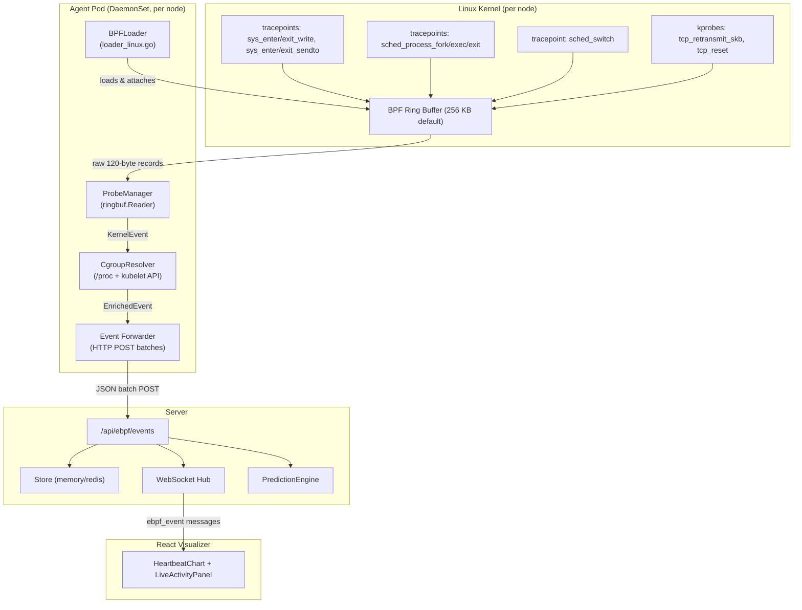

# Design Document: eBPF Agent Real Kernel Integration

## Overview

This design describes how to make the Earthworm eBPF agent operational on real Linux kernels, replacing the current mock-data pipeline with live kernel event collection. The existing scaffolding — C probe programs in `src/ebpf/`, Go agent code in `src/agent/`, server ingestion in `src/server/`, Helm chart in `deploy/helm/` — provides the skeleton. This feature fills in the gaps: wiring bpf2go code generation into the build, implementing real BPF program loading and ring buffer reading in `loader_linux.go`, completing the cgroup-to-pod resolution via `/proc/<pid>/cgroup`, and ensuring the Helm DaemonSet mounts the required host paths.

The end-to-end data flow is:

```
kernel tracepoints/kprobes
  → BPF ring buffer (kernel_event structs, 120 bytes each)
    → Go agent (ringbuf.Reader → decode → enrich via CgroupResolver)
      → HTTP POST batches to server /api/ebpf/events
        → server persists + broadcasts via WebSocket (type: "ebpf_event")
          → React visualizer renders live kernel activity
```

All Go-level logic (event codec, enrichment, batching, cgroup cache) is testable on macOS via the existing `loader_stub.go` build-tag mechanism. Only BPF compilation, loading, and integration tests require a Linux 5.8+ host.

## Architecture



### Platform Separation Strategy

| Concern | macOS (dev) | Linux (prod) |
|---|---|---|
| BPFLoader | `loader_stub.go` — returns error from `Load()` | `loader_linux.go` — real cilium/ebpf loading |
| Agent startup | Logs "eBPF not supported", continues without probes | Loads all 4 programs, attaches to hooks |
| Unit tests | All pass (event codec, enrichment, batching, cgroup cache) | All pass + integration tests with real kernel |
| Docker build | N/A (build runs in Linux container) | Multi-stage: clang → bpf2go → distroless |
| bpf2go codegen | Skipped (build-tagged `//go:build ignore`) | `go generate ./src/agent/...` |

## Components and Interfaces

### 1. BPFLoader (`src/agent/loader_linux.go`)

The existing skeleton checks kernel version and capabilities. The implementation needs to:

- Call bpf2go-generated `Load*Objects()` functions for each program set
- Attach programs to their hook points via `link.Tracepoint()` and `link.Kprobe()`
- Store `link.Link` handles for cleanup
- Open the shared ring buffer map from any of the loaded object sets
- Return the `ringbuf.Reader` to the ProbeManager

```go
// LoadResult contains everything the ProbeManager needs after loading.
type LoadResult struct {
    RingBufReader *ringbuf.Reader
    Links         []link.Link
    AttachedCount int
}

// BPFLoader interface (satisfied by both linux and stub implementations)
type BPFLoaderIface interface {
    Load() (*LoadResult, error)
    Close() error
}
```

### 2. ProbeManager (`src/agent/probe_manager.go`)

Currently has a ticker-based polling loop that does nothing. The real implementation:

- Accepts a `*ringbuf.Reader` from the BPFLoader
- Calls `reader.Read()` in a blocking loop (replaces ticker)
- Decodes each `ringbuf.Record.RawSample` via `UnmarshalBinary`
- Enriches via `CgroupResolver.Enrich()`
- Sends to event channel (drops + counts if full)

```go
// Start begins reading from the ring buffer. Blocks until ctx is cancelled.
func (pm *ProbeManager) Start(ctx context.Context, reader *ringbuf.Reader) error
```

### 3. CgroupResolver (`src/agent/cgroup_resolver.go`)

The existing implementation queries the kubelet `/pods` endpoint but doesn't actually build the cgroup-ID-to-pod mapping. The completion requires:

- For each pod's container, read `/proc/<pid>/cgroup` to extract the cgroup path
- Parse the cgroup path to extract the cgroup ID (via `unix.Statx` or reading the inode)
- Alternatively, use `bpf_get_current_cgroup_id()` which returns the cgroup v2 inode number, and match it by stat-ing the cgroup path under `/sys/fs/cgroup`
- Build the `map[uint64]PodIdentity` cache

```go
// refresh queries kubelet and rebuilds the cgroup-to-pod mapping.
func (cr *CgroupResolver) refresh() error
```

### 4. Event Forwarder (`src/agent/main.go`)

Already implemented in `forwardEvents()`. No changes needed — it batches up to 100 events or flushes every 1 second, POSTs to `/api/ebpf/events`.

### 5. Server Event Ingestion (`src/server/main.go`)

Already implemented in `ebpfEventsHandler()`. Decodes JSON array, persists to store, broadcasts via WebSocket hub, feeds PredictionEngine. No changes needed.

### 6. Helm Chart (`deploy/helm/earthworm/`)

The DaemonSet template needs:

- Volume mounts for `/sys/fs/cgroup` (read-only) and `/proc` (read-only)
- Environment variables for `EARTHWORM_NODE_NAME` (from `fieldRef: spec.nodeName`)
- The existing capabilities (CAP_BPF, CAP_SYS_ADMIN, CAP_PERFMON) are already present

### 7. Dockerfile.agent (`deploy/docker/Dockerfile.agent`)

Already implements the multi-stage build. The only gap is running `go generate` in the Go builder stage, which is already present. The `vmlinux.h` header needs to be available in the BPF compilation stage — it should be generated or downloaded as part of the build.

## Data Models

### KernelEvent (binary, 120 bytes)

Already defined in `src/ebpf/headers/common.h` and mirrored in `src/agent/event.go`. The C struct and Go struct are byte-for-byte compatible with explicit padding handling in `MarshalBinary`/`UnmarshalBinary`.

```
Offset  Field            Type     Size
──────  ───────────────  ───────  ────
  0     timestamp        u64      8
  8     pid              u32      4
 12     ppid             u32      4
 16     tgid             u32      4
 20     [padding]                 4
 24     cgroup_id        u64      8
 32     comm             char[16] 16
 48     event_type       u8       1
 49     [padding]                 3
 52     syscall_nr       u32      4
 56     ret_val          s64      8
 64     entry_ts         u64      8
 72     exit_ts          u64      8
 80     slow_syscall     u8       1
 81     [padding]                 3
 84     child_pid        u32      4
 88     exit_code        s32      4
 92     critical_exit    u8       1
 93     [padding]                 3
 96     saddr            u32      4
100     daddr            u32      4
104     sport            u16      2
106     dport            u16      2
108     net_event_type   u8       1
109     [padding]                 3
112     rtt_us           u32      4
116     [padding]                 4
──────                           ────
Total                            120
```

### EnrichedEvent (JSON)

Already defined in `src/agent/event.go` and mirrored in `src/server/kernel_event.go`. Combines decoded kernel fields with pod identity from CgroupResolver.

Key fields: `timestamp`, `pid`, `ppid`, `tgid`, `comm`, `cgroupId`, `eventType`, plus type-specific fields (syscall latency, process exit code, network 4-tuple), plus enrichment fields (`podName`, `namespace`, `containerName`, `nodeName`, `hostLevel`).

### PodIdentity

```go
type PodIdentity struct {
    PodName       string `json:"podName,omitempty"`
    Namespace     string `json:"namespace,omitempty"`
    ContainerName string `json:"containerName,omitempty"`
    NodeName      string `json:"nodeName"`
}
```

### WebSocket Message Envelope

```json
{
  "type": "ebpf_event",
  "payload": { /* EnrichedEvent */ }
}
```

### Helm Values (relevant subset)

```yaml
ebpf:
  enabled: true
  ringBufferSizeKB: 256

agent:
  image: earthworm/agent:latest
  nodeSelector: {}
  tolerations: []
```


## Correctness Properties

*A property is a characteristic or behavior that should hold true across all valid executions of a system — essentially, a formal statement about what the system should do. Properties serve as the bridge between human-readable specifications and machine-verifiable correctness guarantees.*

### Property 1: KernelEvent binary round-trip

*For any* valid KernelEvent struct, encoding it via `MarshalBinary` and then decoding the resulting 120-byte buffer via `UnmarshalBinary` shall produce a KernelEvent identical to the original across all fields (timestamp, pid, ppid, tgid, cgroup_id, comm, event_type, and all type-specific fields). Additionally, the encoded buffer shall be exactly 120 bytes.

**Validates: Requirements 5.5, 10.1, 10.2, 10.4, 3.2**

### Property 2: EnrichedEvent JSON round-trip

*For any* valid KernelEvent and any PodIdentity, enriching the KernelEvent via `Enrich()` and then serializing the resulting EnrichedEvent to JSON and deserializing it back shall produce an EnrichedEvent equivalent to the original (all fields preserved through the JSON codec).

**Validates: Requirements 5.6**

### Property 3: Cgroup resolution correctness

*For any* CgroupResolver with a populated cache, and *for any* KernelEvent:
- If the event's cgroup ID is present in the cache, enrichment shall return the cached PodIdentity with `hostLevel` set to false and all pod identity fields (podName, namespace, containerName) populated.
- If the event's cgroup ID is not present in the cache, enrichment shall return `hostLevel` set to true with empty podName, namespace, and containerName, and only nodeName populated.

**Validates: Requirements 4.3, 4.4, 5.1**

### Property 4: Conditional flag consistency

*For any* valid KernelEvent where the `slow_syscall`, `critical_exit`, and `net_event_type` flags are set consistently with the measured values (syscall duration vs threshold, kubelet exit code, RTT vs threshold), `ValidateFlags()` shall return true. *For any* KernelEvent where a flag contradicts its measured value, `ValidateFlags()` shall return false.

**Validates: Requirements 10.5**

### Property 5: BPF Loader cleanup invariant

*For any* BPFLoader with any number of loaded programs, calling `Close()` shall release all program resources such that `Programs()` returns an empty map. Calling `Close()` a second time shall be idempotent (no error, no change).

**Validates: Requirements 2.5**

### Property 6: Drop counter accuracy

*For any* ProbeManager with a full event channel, each event that cannot be placed on the channel shall increment the dropped-event counter by exactly one. The counter value shall equal the total number of events that were dropped.

**Validates: Requirements 3.4, 12.1**

### Property 7: Short buffer rejection

*For any* byte buffer with length less than 120, calling `UnmarshalBinary` shall return a non-nil error. The error message shall contain both the actual buffer size and the required size (120).

**Validates: Requirements 10.3**

### Property 8: Server batch ingestion completeness

*For any* valid JSON array of EnrichedEvents POSTed to `/api/ebpf/events`, the server shall persist every event in the array to the store and broadcast every event to connected WebSocket clients. The number of persisted events and broadcast events shall equal the length of the input array.

**Validates: Requirements 9.1**

## Error Handling

### BPF Loading Errors

| Error Condition | Behavior | Exit? |
|---|---|---|
| Kernel < 5.8 | Log version mismatch, return error from `Load()` | Yes (Req 11.4) |
| Missing CAP_BPF/CAP_SYS_ADMIN | Log capability error, return error from `Load()` | Yes (Req 11.4) |
| Missing BTF (`/sys/kernel/btf/vmlinux`) | Log BTF missing, return error from `Load()` | Yes (Req 11.4) |
| Non-Linux platform | `loader_stub.go` returns "eBPF not supported" | No — agent continues without probes (Req 6.2) |
| BPF verifier rejection | Log verifier output, return error from `Load()` | Yes |

### Ring Buffer Errors

| Error Condition | Behavior |
|---|---|
| Transient read error | Log error, continue reading (Req 3.3) |
| Event channel full | Increment drop counter, log at most once per 10s (Req 3.4, 12.2) |
| Ring buffer overflow (kernel side) | Kernel drops events; agent sees no error but events are lost |

### Cgroup Resolution Errors

| Error Condition | Behavior |
|---|---|
| Kubelet API unreachable | Retain stale cache, log warning (Req 4.5) |
| `/proc/<pid>/cgroup` unreadable | Skip that container, log warning |
| Unknown cgroup ID | Return host-level identity (Req 4.4) |

### Event Forwarding Errors

| Error Condition | Behavior |
|---|---|
| Server returns HTTP >= 400 | Log status code, discard batch (Req 5.3) |
| Server unreachable | Log connection error, retry next flush (Req 5.4) |
| JSON marshal failure | Log error, skip batch |

### Server Ingestion Errors

| Error Condition | Behavior |
|---|---|
| Invalid JSON body | Return HTTP 400 with error message (Req 9.2) |
| Store persistence failure | Log error, continue with remaining events |

## Testing Strategy

### Dual Testing Approach

This feature uses both unit/example tests and property-based tests. The property-based tests use the `pgregory.net/rapid` library (already in `go.mod`) with a minimum of 100 iterations per property.

### Property-Based Tests (Go, `pgregory.net/rapid`)

Each property test references its design document property via a comment tag.

| Property | Test Function | Tag | Platform |
|---|---|---|---|
| Property 1: KernelEvent binary round-trip | `TestKernelEventBinaryRoundTrip` | Feature: ebpf-agent-real-kernel, Property 1: KernelEvent binary round-trip | macOS + Linux |
| Property 2: EnrichedEvent JSON round-trip | `TestEnrichedEventJSONRoundTrip` | Feature: ebpf-agent-real-kernel, Property 2: EnrichedEvent JSON round-trip | macOS + Linux |
| Property 3: Cgroup resolution correctness | `TestCgroupResolutionCorrectness` | Feature: ebpf-agent-real-kernel, Property 3: Cgroup resolution correctness | macOS + Linux |
| Property 4: Conditional flag consistency | `TestConditionalFlagCorrectness` | Feature: ebpf-agent-real-kernel, Property 4: Conditional flag consistency | macOS + Linux |
| Property 5: BPF Loader cleanup invariant | `TestBPFLoaderCleanupInvariant` | Feature: ebpf-agent-real-kernel, Property 5: BPF Loader cleanup invariant | macOS + Linux |
| Property 6: Drop counter accuracy | `TestDropCounterAccuracy` | Feature: ebpf-agent-real-kernel, Property 6: Drop counter accuracy | macOS + Linux |
| Property 7: Short buffer rejection | `TestShortBufferRejection` | Feature: ebpf-agent-real-kernel, Property 7: Short buffer rejection | macOS + Linux |
| Property 8: Server batch ingestion | `TestServerBatchIngestion` | Feature: ebpf-agent-real-kernel, Property 8: Server batch ingestion completeness | macOS + Linux |

Each property-based test must:
- Run a minimum of 100 iterations (rapid's default is 100, which satisfies this)
- Include a comment tag: `// Feature: ebpf-agent-real-kernel, Property {N}: {title}`
- Be implemented as a single `rapid.Check` call per property

### Unit / Example Tests

| Test | What it verifies | Platform |
|---|---|---|
| `TestBpf2goGeneration` | `go generate` produces expected files (Req 1.1) | Linux only |
| `TestBPFLoadAndAttach` | All 4 programs load and attach to hooks (Req 2.1, 2.2) | Linux only (integration) |
| `TestDockerBuild` | `docker build` completes, image < 50 MB (Req 7.4, 7.5) | Linux (Docker) |
| `TestHelmDaemonSetEnabled` | Helm renders DaemonSet when `ebpf.enabled=true` (Req 8.1) | macOS + Linux |
| `TestHelmDaemonSetDisabled` | Helm does not render DaemonSet when `ebpf.enabled=false` (Req 8.2) | macOS + Linux |
| `TestHelmVolumeMounts` | DaemonSet mounts `/sys/fs/cgroup` and `/proc` (Req 8.5) | macOS + Linux |
| `TestHelmRBAC` | RBAC resources are rendered (Req 8.6) | macOS + Linux |
| `TestStubLoaderReturnsError` | `loader_stub.go` Load() returns error (Req 6.1) | macOS |
| `TestAgentContinuesWithoutEBPF` | Agent logs error and continues when Load() fails (Req 6.2) | macOS + Linux |
| `TestServerRejectsInvalidJSON` | POST with bad JSON returns 400 (Req 9.2) | macOS + Linux |
| `TestKubeletAPIUnreachable` | CgroupResolver retains stale cache on API failure (Req 4.5) | macOS + Linux |

### Test Organization

- `src/agent/*_test.go` — All agent-side property and unit tests (macOS-safe via build tags)
- `src/server/*_test.go` — Server ingestion property and unit tests
- `deploy/helm/earthworm/tests/` — Helm template tests
- Integration tests requiring real kernel: tagged with `//go:build integration && linux`
