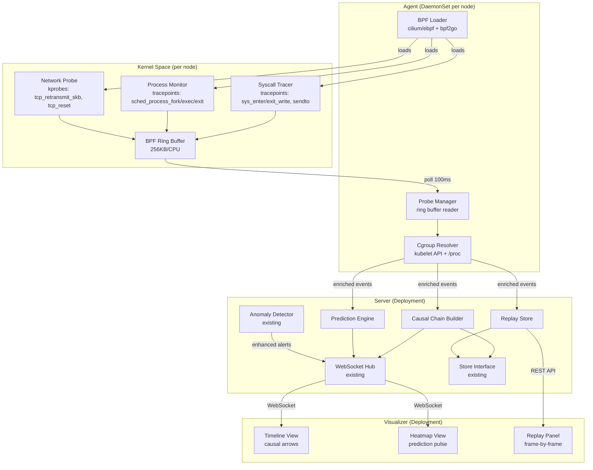

# Design Document: eBPF Kernel Observability

## Overview

This design extends Earthworm from simulated eBPF data to real kernel-level observability using Linux eBPF. The system attaches BPF programs to kernel tracepoints and kprobes to capture syscall traces, process lifecycle events, and TCP network events. These kernel events flow through a pipeline: BPF ring buffer → Go userspace reader → cgroup-to-pod enrichment → causal chain analysis → prediction engine → WebSocket broadcast to the visualizer.

The architecture follows a layered approach:
1. **Kernel layer**: BPF C programs compiled with clang/LLVM, using CO-RE for portability across kernel 5.8+
2. **Agent layer**: Go binary using cilium/ebpf to load BPF programs, read ring buffers, and resolve cgroup-to-pod mappings
3. **Server layer**: Existing Earthworm server extended with causal chain builder, prediction engine, and replay store
4. **Visualizer layer**: Existing React UI extended with causal overlays, prediction indicators, and replay controls

The agent runs as a DaemonSet on each node. The server and UI run as Deployments. All components are packaged as container images and deployed via Helm.



### Key Design Decisions

1. **BPF ring buffer over perf event arrays**: Ring buffers (kernel 5.8+) provide lower overhead, no per-CPU allocation waste, and simpler consumption. The existing `heartbeat.c` uses perf event arrays — this will be migrated.

2. **Agent/Server split**: The BPF loader and probe manager run on each node (DaemonSet) because BPF programs must be loaded on the host where they trace. The causal chain builder and prediction engine run centrally on the server to correlate cross-node patterns.

3. **cilium/ebpf + bpf2go**: Build-time code generation via `bpf2go` produces type-safe Go bindings for BPF maps and programs, eliminating runtime compilation dependencies. The agent binary ships with pre-compiled `.o` files.

4. **CO-RE for portability**: BPF CO-RE with BTF type information allows a single compiled BPF object to run across kernel versions 5.8+, avoiding per-kernel compilation.

5. **Graceful degradation**: When eBPF is unavailable (wrong kernel, missing capabilities, macOS dev), the system falls back to existing mock behavior. The `--ebpf` flag controls this.

## Architecture

### Component Topology

```
deploy/
├── helm/earthworm/
│   ├── Chart.yaml
│   ├── values.yaml
│   └── templates/
│       ├── agent-daemonset.yaml
│       ├── server-deployment.yaml
│       ├── ui-deployment.yaml
│       ├── rbac.yaml
│       ├── configmap.yaml
│       └── services.yaml
├── docker/
│   ├── Dockerfile.agent
│   ├── Dockerfile.server
│   └── Dockerfile.ui
└── earthworm.yaml          # standalone kubectl manifest
```

### Source Code Layout (new/modified files)

```
src/
├── ebpf/
│   ├── headers/              # vmlinux.h (BTF-generated), bpf_helpers
│   ├── syscall_tracer.c      # sys_enter/exit_write, sendto tracepoints
│   ├── process_monitor.c     # sched_process_fork/exec/exit tracepoints
│   ├── network_probe.c       # tcp_retransmit_skb, tcp_reset kprobes
│   └── heartbeat.c           # (existing, to be refactored to ring buffer)
├── agent/
│   ├── main.go               # agent entrypoint, BPF loader init
│   ├── loader.go             # BPF program compilation/loading via cilium/ebpf
│   ├── probe_manager.go      # ring buffer reader, event forwarding
│   ├── cgroup_resolver.go    # cgroup ID → pod mapping
│   └── gen.go                # //go:generate bpf2go directives
├── server/
│   ├── main.go               # (modified) --ebpf flag, agent event ingestion
│   ├── store.go              # (modified) extended Store interface for eBPF events
│   ├── causal_chain.go       # causal chain builder
│   ├── prediction.go         # prediction engine
│   ├── replay.go             # replay store and API handlers
│   └── ws.go                 # (modified) new message types
├── heartbeat-visualizer/src/
│   ├── hooks/useWebSocket.ts # (modified) new message handlers
│   ├── views/TimelineView.tsx# (modified) causal overlay, replay button
│   └── views/HeatmapView.tsx # (modified) prediction pulse indicator
```

### Event Flow

1. BPF programs emit `KernelEvent` structs to a shared ring buffer map
2. Agent's `ProbeManager` polls the ring buffer every 100ms via cilium/ebpf's `ringbuf.Reader`
3. `CgroupResolver` enriches each event with pod/container identity
4. Enriched events are sent to the server via gRPC or HTTP POST (batched)
5. Server routes events to: `CausalChainBuilder`, `PredictionEngine`, `ReplayStore`
6. `CausalChainBuilder` correlates events when a node goes NotReady
7. `PredictionEngine` analyzes sliding windows for failure patterns
8. All outputs broadcast via existing `WebSocket Hub` to visualizer clients

## Components and Interfaces

### BPF Loader (`src/agent/loader.go`)

```go
// BPFLoader manages the lifecycle of eBPF programs.
type BPFLoader struct {
    programs map[string]*ebpf.Program
    links    []link.Link
    specs    map[string]*ebpf.CollectionSpec
}

// Load compiles and loads all BPF programs from the generated objects.
// Returns an error if kernel version < 5.8 or capabilities are missing.
func (l *BPFLoader) Load() error

// Close detaches all programs and closes map FDs.
func (l *BPFLoader) Close() error

// Programs returns loaded program references for the ProbeManager.
func (l *BPFLoader) Programs() map[string]*ebpf.Program
```

### Probe Manager (`src/agent/probe_manager.go`)

```go
// ProbeManager reads events from BPF ring buffers and forwards them.
type ProbeManager struct {
    reader     *ringbuf.Reader
    resolver   *CgroupResolver
    eventCh    chan<- EnrichedEvent
    droppedCnt atomic.Uint64
}

// Start begins polling the ring buffer. Blocks until ctx is cancelled.
func (pm *ProbeManager) Start(ctx context.Context) error

// DroppedEvents returns the count of dropped ring buffer events.
func (pm *ProbeManager) DroppedEvents() uint64
```

### Cgroup Resolver (`src/agent/cgroup_resolver.go`)

```go
// CgroupResolver maps cgroup IDs to Kubernetes pod identities.
type CgroupResolver struct {
    cache       map[uint64]PodIdentity
    mu          sync.RWMutex
    refreshRate time.Duration // default 30s
}

type PodIdentity struct {
    PodName       string
    Namespace     string
    ContainerName string
    NodeName      string
}

// Resolve enriches a KernelEvent with pod identity.
// Returns "host-level" identity if cgroup is unknown.
func (cr *CgroupResolver) Resolve(cgroupID uint64, comm string) PodIdentity

// StartRefresh begins periodic cache refresh from kubelet API.
func (cr *CgroupResolver) StartRefresh(ctx context.Context) error
```

### Causal Chain Builder (`src/server/causal_chain.go`)

```go
// CausalChainBuilder correlates kernel events into causal chains.
type CausalChainBuilder struct {
    store       Store
    hub         *Hub
    windowSize  time.Duration // 120 seconds lookback
}

// CausalChain represents an ordered sequence of correlated events.
type CausalChain struct {
    NodeName    string           `json:"nodeName"`
    Timestamp   time.Time        `json:"timestamp"`
    Events      []EnrichedEvent  `json:"events"`
    Summary     string           `json:"summary"`
    RootCause   string           `json:"rootCause"`
}

// OnNotReady is called when a node transitions to NotReady.
// Builds and broadcasts a causal chain.
func (ccb *CausalChainBuilder) OnNotReady(nodeName string, transitionTime time.Time) (*CausalChain, error)
```

### Prediction Engine (`src/server/prediction.go`)

```go
// PredictionEngine analyzes kernel event patterns for failure prediction.
type PredictionEngine struct {
    store          Store
    hub            *Hub
    windowSize     time.Duration // sliding window for pattern analysis
    predictions    []Prediction
    mu             sync.Mutex
}

type Prediction struct {
    NodeName       string    `json:"nodeName"`
    Confidence     float64   `json:"confidence"`    // 0.0 to 1.0
    TimeToFailure  float64   `json:"ttfSeconds"`    // predicted seconds until NotReady
    Timestamp      time.Time `json:"timestamp"`
    Patterns       []string  `json:"patterns"`      // detected pattern names
    Outcome        string    `json:"outcome"`       // "pending", "true_positive", "false_positive"
}

// Analyze evaluates the latest event window for a node.
func (pe *PredictionEngine) Analyze(nodeName string, events []EnrichedEvent) *Prediction

// Accuracy returns prediction accuracy metrics.
func (pe *PredictionEngine) Accuracy() AccuracyMetrics
```

### Replay Store (`src/server/replay.go`)

```go
// ReplayStore persists and queries kernel events for post-mortem replay.
type ReplayStore struct {
    store     Store
    retention time.Duration // default 24h
}

type ReplayQuery struct {
    NodeName     string
    From         time.Time
    To           time.Time
    EventTypes   []string  // "syscall", "process", "network"
    PodName      string
    MinLatencyMs int64
    Page         int
    PageSize     int       // default 1000
}

// Query returns paginated kernel events matching the filter.
func (rs *ReplayStore) Query(ctx context.Context, q ReplayQuery) ([]EnrichedEvent, int, error)
```

### Extended Store Interface (`src/server/store.go`)

```go
// Extended Store interface (additions to existing)
type Store interface {
    // ... existing methods ...
    SaveKernelEvent(ctx context.Context, event EnrichedEvent) error
    GetKernelEvents(ctx context.Context, nodeName string, from, to time.Time) ([]EnrichedEvent, error)
    GetKernelEventsByType(ctx context.Context, nodeName string, eventType string, from, to time.Time) ([]EnrichedEvent, error)
    SaveCausalChain(ctx context.Context, chain CausalChain) error
    GetCausalChains(ctx context.Context, nodeName string, from, to time.Time) ([]CausalChain, error)
}
```

### Extended WebSocket Messages (`src/server/ws.go`)

New message types added to the existing `WSMessage` envelope:

```go
// New WSMessage types:
// "ebpf_event"    - enriched kernel event with pod attribution
// "causal_chain"  - complete causal chain for a NotReady transition
// "prediction"    - predictive failure alert with confidence score
```

### Visualizer Extensions

```typescript
// New WebSocket message handlers in useWebSocket.ts
interface KernelEventMessage {
  type: 'ebpf_event';
  payload: EnrichedKernelEvent;
}

interface CausalChainMessage {
  type: 'causal_chain';
  payload: {
    nodeName: string;
    timestamp: number;
    events: EnrichedKernelEvent[];
    summary: string;
    rootCause: string;
  };
}

interface PredictionMessage {
  type: 'prediction';
  payload: {
    nodeName: string;
    confidence: number;
    ttfSeconds: number;
    patterns: string[];
  };
}
```

## Data Models

### KernelEvent (BPF → Userspace)

The core event struct shared across all BPF programs, emitted via ring buffer:

```c
// Shared kernel event structure (src/ebpf/common.h)
struct kernel_event {
    u64 timestamp;        // ktime_get_ns()
    u32 pid;
    u32 ppid;
    u32 tgid;
    u64 cgroup_id;        // bpf_get_current_cgroup_id()
    char comm[16];
    u8  event_type;       // 0=syscall, 1=process, 2=network
    
    // Syscall fields
    u32 syscall_nr;
    s64 ret_val;
    u64 entry_ts;         // syscall entry timestamp
    u64 exit_ts;          // syscall exit timestamp
    u8  slow_syscall;     // 1 if duration > 1s
    
    // Process fields
    u32 child_pid;
    s32 exit_code;
    u8  critical_exit;    // 1 if non-zero exit from kubelet
    
    // Network fields
    u32 saddr;
    u32 daddr;
    u16 sport;
    u16 dport;
    u8  net_event_type;   // 0=retransmit, 1=reset, 2=rtt_high
    u32 rtt_us;           // round-trip time in microseconds
};
```

### EnrichedEvent (Go userspace)

```go
type EnrichedEvent struct {
    // From BPF
    Timestamp    time.Time `json:"timestamp"`
    PID          uint32    `json:"pid"`
    PPID         uint32    `json:"ppid"`
    Comm         string    `json:"comm"`
    CgroupID     uint64    `json:"cgroupId"`
    EventType    string    `json:"eventType"` // "syscall", "process", "network"
    
    // Syscall-specific
    SyscallName  string    `json:"syscallName,omitempty"`
    ReturnValue  int64     `json:"returnValue,omitempty"`
    LatencyNs    uint64    `json:"latencyNs,omitempty"`
    SlowSyscall  bool      `json:"slowSyscall,omitempty"`
    
    // Process-specific
    ChildPID     uint32    `json:"childPid,omitempty"`
    ExitCode     int32     `json:"exitCode,omitempty"`
    CriticalExit bool     `json:"criticalExit,omitempty"`
    
    // Network-specific
    SrcAddr      string    `json:"srcAddr,omitempty"`
    DstAddr      string    `json:"dstAddr,omitempty"`
    SrcPort      uint16    `json:"srcPort,omitempty"`
    DstPort      uint16    `json:"dstPort,omitempty"`
    NetEventType string    `json:"netEventType,omitempty"` // "retransmit", "reset", "rtt_high"
    RTTUs        uint32    `json:"rttUs,omitempty"`
    
    // Enrichment (from CgroupResolver)
    PodName       string   `json:"podName,omitempty"`
    Namespace     string   `json:"namespace,omitempty"`
    ContainerName string   `json:"containerName,omitempty"`
    NodeName      string   `json:"nodeName"`
    HostLevel     bool     `json:"hostLevel,omitempty"`
}
```

### BPF Maps

```c
// Ring buffer for all kernel events (shared across programs)
struct {
    __uint(type, BPF_MAP_TYPE_RINGBUF);
    __uint(max_entries, 256 * 1024); // 256KB, configurable
} events SEC(".maps");

// Per-CPU syscall counter for overhead monitoring
struct {
    __uint(type, BPF_MAP_TYPE_PERCPU_ARRAY);
    __type(key, u32);
    __type(value, u64);
    __uint(max_entries, 1);
} syscall_count SEC(".maps");

// Hash map for tracking in-flight syscalls (entry timestamp)
struct {
    __uint(type, BPF_MAP_TYPE_HASH);
    __type(key, u64);   // tgid_pid
    __type(value, u64); // entry timestamp
    __uint(max_entries, 10240);
} inflight_syscalls SEC(".maps");
```

### Helm Values Schema

```yaml
# values.yaml key fields
ebpf:
  enabled: true
  ringBufferSizeKB: 256
agent:
  image: earthworm/agent:latest
  nodeSelector: {}
  tolerations: []
  resources:
    limits:
      cpu: "200m"
      memory: "50Mi"
server:
  replicas: 1
  image: earthworm/server:latest
  store: memory  # or "redis"
  warningThreshold: 10
  criticalThreshold: 40
  prediction:
    enabled: true
  replay:
    retentionHours: 24
ui:
  replicas: 1
  image: earthworm/ui:latest
  serviceType: ClusterIP
```


## Correctness Properties

*A property is a characteristic or behavior that should hold true across all valid executions of a system — essentially, a formal statement about what the system should do. Properties serve as the bridge between human-readable specifications and machine-verifiable correctness guarantees.*

### Property 1: BPF Loader Cleanup Invariant

*For any* BPF loader that has successfully loaded one or more programs, calling `Close()` shall result in all programs being detached and all map file descriptors being closed, such that `Programs()` returns an empty map and no BPF resources remain referenced.

**Validates: Requirements 1.4**

### Property 2: KernelEvent Field Completeness by Type

*For any* KernelEvent emitted by a BPF program, the event shall contain all required fields for its event type:
- Syscall events: syscall name, entry timestamp, exit timestamp, return value, PID, comm, and cgroup ID must all be non-zero/non-empty
- Process events: PID, PPID, comm, and cgroup ID must be non-zero/non-empty; exit events must include exit code; fork events must include child PID
- Network events: source IP, destination IP, source port, destination port, and net event type must all be non-zero/non-empty

**Validates: Requirements 2.2, 3.2, 3.3, 4.3**

### Property 3: Conditional Flag Correctness

*For any* KernelEvent, conditional flags shall be set correctly based on the event's measured values:
- `slow_syscall` is true if and only if the syscall duration (exit_ts - entry_ts) exceeds 1 second
- `critical_exit` is true if and only if the process comm is "kubelet" and the exit code is non-zero
- `net_event_type` is "rtt_high" if and only if the measured RTT exceeds 500 milliseconds

**Validates: Requirements 2.3, 3.4, 4.4**

### Property 4: Comm Filter Invariant

*For any* KernelEvent emitted by the Syscall_Tracer or Process_Monitor, the `comm` field shall match one of the allowed process names: "kubelet", "containerd", or "cri-o".

**Validates: Requirements 2.4**

### Property 5: Cgroup Enrichment Completeness

*For any* KernelEvent with a cgroup ID that exists in the CgroupResolver's mapping, the enriched event shall contain non-empty `podName`, `namespace`, `containerName`, and `nodeName` fields, and `hostLevel` shall be false.

**Validates: Requirements 5.1, 5.3**

### Property 6: Unknown Cgroup Host-Level Labeling

*For any* KernelEvent with a cgroup ID that does not exist in the CgroupResolver's mapping, the enriched event shall have `hostLevel` set to true and the `comm` field preserved as the workload identifier.

**Validates: Requirements 5.4**

### Property 7: Causal Chain Construction Invariants

*For any* causal chain constructed by the CausalChainBuilder for a NotReady transition at time T:
1. All events in the chain shall have timestamps within [T - 120s, T]
2. Events shall be ordered chronologically (each event's timestamp ≤ the next event's timestamp)
3. The summary string shall be non-empty

**Validates: Requirements 6.1, 6.2, 6.3**

### Property 8: Prediction Confidence Bounds

*For any* prediction emitted by the PredictionEngine, the `confidence` value shall be in the range [0.0, 1.0] and the `timeToFailure` value shall be positive.

**Validates: Requirements 7.2**

### Property 9: Prediction Accuracy Computation

*For any* set of predictions with known outcomes (true_positive or false_positive), the PredictionEngine's accuracy metrics shall satisfy: `truePositiveRate = truePositives / (truePositives + falseNegatives)` and `falsePositiveRate = falsePositives / (falsePositives + trueNegatives)`, both in [0.0, 1.0].

**Validates: Requirements 7.5**

### Property 10: KernelEvent Persistence Round-Trip

*For any* valid EnrichedEvent, storing it via the Store interface and then querying it back by node name and time range shall return an event with equivalent field values.

**Validates: Requirements 9.1**

### Property 11: Replay Query Filter Correctness

*For any* set of stored KernelEvents and any ReplayQuery specifying filters (node name, time range, event type, pod name), all returned events shall match every specified filter, and the results shall be ordered chronologically.

**Validates: Requirements 9.2, 9.3**

### Property 12: Replay Pagination Bounds

*For any* ReplayQuery with a specified page size, the number of returned events shall not exceed the page size. When the total matching events exceed the page size, subsequent pages shall return the remaining events without duplicates or gaps.

**Validates: Requirements 9.4**

### Property 13: WSMessage Envelope Compliance

*For any* enriched KernelEvent broadcast via the WebSocket Hub, the serialized message shall conform to the WSMessage format with a `type` field set to "ebpf_event" and a `payload` field containing the enriched event data.

**Validates: Requirements 11.1**

### Property 14: Enhanced Alert with Kernel Events

*For any* anomaly alert generated when correlated KernelEvents exist in the preceding 120-second window, the alert payload shall include those kernel events. The included events shall all have timestamps within [alert_time - 120s, alert_time] and match the alert's node name.

**Validates: Requirements 11.3**

### Property 15: KernelEvent Binary Round-Trip

*For any* valid KernelEvent struct, encoding it to the BPF binary wire format and then decoding it back to a Go struct shall produce a value equivalent to the original. Conversely, decoding a valid binary event and re-encoding it shall produce the same byte sequence.

**Validates: Requirements 13.6**

### Property 16: Helm Template Configuration Propagation

*For any* valid Helm `values.yaml` configuration:
- When `ebpf.enabled` is true, the rendered templates shall include an `earthworm-agent` DaemonSet with `hostPID: true` and capabilities `CAP_BPF`, `CAP_SYS_ADMIN`, `CAP_PERFMON`
- When `ebpf.enabled` is false, the rendered templates shall not include the agent DaemonSet
- ConfigMap values (thresholds, store type, ring buffer size, retention period) shall match the provided values.yaml overrides

**Validates: Requirements 14.2, 14.6, 14.11**

## Error Handling

### BPF Loader Errors

| Error Condition | Handling Strategy |
|---|---|
| Kernel version < 5.8 | Log error with required version, set `ebpfAvailable=false`, continue with mock mode |
| Missing CAP_BPF/CAP_SYS_ADMIN | Log error with missing capability name, set `ebpfAvailable=false`, continue with mock mode |
| BPF verifier rejection | Log verifier output for the failed program, skip it, continue loading remaining programs |
| BTF not available | Log error, fall back to mock mode (CO-RE requires BTF) |
| Ring buffer creation failure | Log error, attempt with smaller buffer size, fail to mock mode if still failing |

### Runtime Errors

| Error Condition | Handling Strategy |
|---|---|
| Ring buffer overflow (events dropped) | Increment `dropped_events` counter, log warning at most once per 10 seconds |
| Cgroup resolver cache miss | Label event as "host-level", use comm as workload identifier |
| Kubelet API unreachable (cgroup refresh) | Keep stale cache, retry on next refresh interval, log warning |
| Store write failure for kernel events | Log error, drop event (don't block the pipeline), increment error counter |
| WebSocket broadcast failure | Existing hub handles client disconnection; dropped messages are acceptable |
| Causal chain with no correlated events | Generate chain with single "unknown_cause" entry |
| Prediction engine pattern match failure | Skip prediction for this window, log at debug level |

### Agent-Server Communication Errors

| Error Condition | Handling Strategy |
|---|---|
| Agent cannot reach server | Buffer events locally (up to 10MB), retry with exponential backoff |
| Server rejects events (4xx) | Log error, drop batch, continue with next batch |
| Server unavailable (5xx) | Retry with exponential backoff, max 5 retries per batch |

### Graceful Degradation Hierarchy

1. Full eBPF mode: all probes active, real kernel data
2. Partial eBPF mode: some probes failed to load, remaining probes active
3. Mock mode: no eBPF available, existing simulated data (current behavior)

The `--ebpf` flag and runtime capability detection determine the mode. The server always starts successfully regardless of eBPF availability.

## Testing Strategy

### Dual Testing Approach

This feature requires both unit tests and property-based tests. Unit tests verify specific examples, edge cases, and integration points. Property-based tests verify universal properties across randomly generated inputs.

### Property-Based Testing

**Library**: `pgregory.net/rapid` (already in go.mod) for Go components, `fast-check` for TypeScript/React components.

**Configuration**: Each property test runs a minimum of 100 iterations. Each test is tagged with a comment referencing the design property.

**Tag format**: `Feature: ebpf-kernel-observability, Property {number}: {property_text}`

Each correctness property (Properties 1-16) shall be implemented by a single property-based test:

- **Properties 1-6, 10, 13-15** (Go agent/server): Tested with `pgregory.net/rapid` using generated `KernelEvent` structs, cgroup mappings, and store operations
- **Properties 7-9, 11-12, 14** (Go server): Tested with `rapid` using generated event histories, predictions, and replay queries
- **Property 16** (Helm): Tested with `rapid` generating random values.yaml configurations and validating rendered templates via `helm template` output parsing

### Unit Tests

Unit tests focus on:

- **Edge cases**: Empty event streams, unknown cgroup IDs, zero-length time ranges, kernel version boundary (5.7 vs 5.8), empty causal chains
- **Integration points**: WebSocket message serialization/deserialization, Store interface method contracts, agent-to-server event forwarding
- **Specific examples**: Known syscall patterns that should trigger slow_syscall flag, known process exit scenarios for critical_exit flag, specific Helm value combinations
- **Error conditions**: BPF verifier rejection handling, ring buffer overflow, store write failures, malformed events

### Test File Organization

```
src/agent/loader_test.go          # Properties 1, 4
src/agent/probe_manager_test.go   # Properties 2, 3
src/agent/cgroup_resolver_test.go # Properties 5, 6
src/server/causal_chain_test.go   # Property 7
src/server/prediction_test.go     # Properties 8, 9
src/server/replay_test.go         # Properties 10, 11, 12
src/server/ws_test.go             # Property 13
src/server/anomaly_test.go        # Property 14
src/agent/event_codec_test.go     # Property 15
deploy/helm/earthworm/tests/      # Property 16
```
