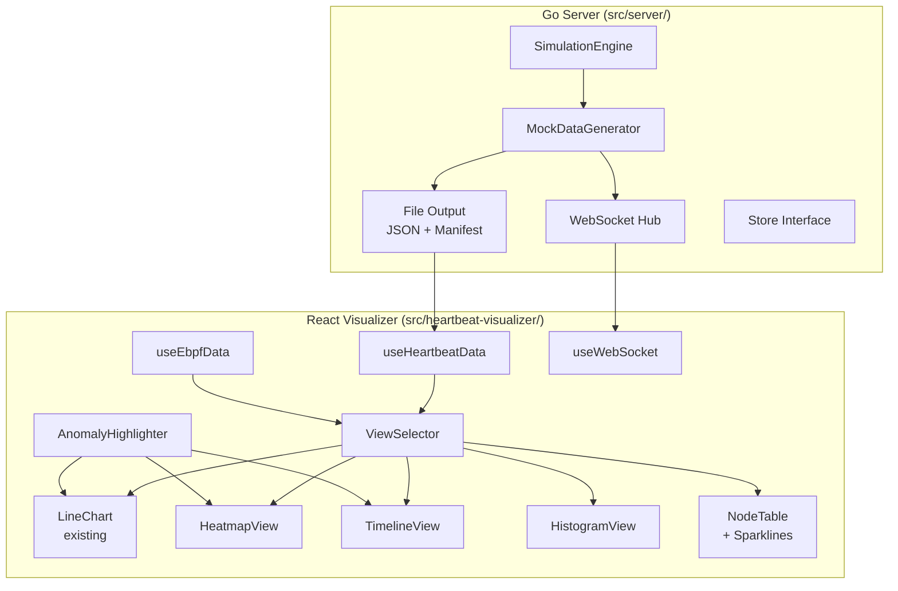

# Design Document: Realistic Data and Visualizations

## Overview

This design covers two complementary enhancements to Earthworm:

1. **Realistic Mock Data Generator** — Replace the flat `GenerateMockNodes()` / `GenerateMockEBPFEvents()` in `src/kubernetes/mock_ebpf.go` with a simulation engine that produces production-like node state transitions, variable lease intervals, rolling deployment scenarios, multi-namespace workloads, correlated eBPF events, and extended time-series output.

2. **Enhanced Visualizations** — Extend the React/TypeScript visualizer with four new view types (Heatmap, Swimlane Timeline, Histogram, Node Table with Sparklines), automatic anomaly highlighting across all views, and a view-switching control that preserves zoom/pan state.

The Go mock generator outputs JSON files in the existing `LeasesByNamespace` format plus eBPF event arrays, consumed by the visualizer's manifest-based incremental loader. The visualizer adds new components alongside the existing `HeartbeatChart` LineChart, sharing the same data hooks and `chartUtils` functions.

Roadmap items (real eBPF integration, advanced alerting) are documented in requirements but explicitly excluded from this design.

## Architecture



### Key Design Decisions

1. **Simulation engine in Go** — The mock generator stays in `src/kubernetes/` as Go code. It uses a tick-based simulation loop that advances a virtual clock, applying health profiles and cluster scenarios at each tick. This keeps the generator co-located with the existing `mock_ebpf.go` and allows direct integration with the Go server's live broadcast loop.

2. **Shared data hooks** — All new views consume data from the existing `useHeartbeatData` and `useEbpfData` hooks. No new data fetching logic is needed. The `ViewSelector` component passes the same `chartData`, `leasesData`, and `ebpfData` to whichever view is active.

3. **Recharts for all views** — The existing project uses Recharts v3. The heatmap will be built with Recharts' `<ScatterChart>` using custom cell shapes. The histogram uses `<BarChart>`. The timeline uses a custom SVG component (Recharts doesn't have native swimlanes) but shares the same time-axis scaling logic. Sparklines use Recharts' `<LineChart>` in a minimal configuration.

4. **Anomaly detection reuse** — The existing `getAnomalies()` function in `chartUtils.ts` is extended to return per-node anomalies (not just per-namespace). New views call this function and apply visual highlighting (pulsing borders, increased opacity) to anomaly regions.

5. **View state preservation** — A shared `ViewContext` (React context) holds the current zoom/pan domain `[xMin, xMax]`. When switching between time-axis views (LineChart, Heatmap, Timeline), the domain is preserved. The Histogram and Table views don't use a time axis and ignore this state.

## Components and Interfaces

### Go: Simulation Engine (`src/kubernetes/`)

#### New Types

```go
// NodeHealthProfile determines a node's behavior during simulation
type NodeHealthProfile string

const (
    ProfileStable   NodeHealthProfile = "stable"
    ProfileNormal   NodeHealthProfile = "normal"
    ProfileDrifting NodeHealthProfile = "drifting"
    ProfileVolatile NodeHealthProfile = "volatile"
)

// NotReadyCause describes why a node went NotReady
type NotReadyCause string

const (
    CauseNetworkBlip    NotReadyCause = "network_blip"
    CauseOOMKill        NotReadyCause = "oom_kill"
    CauseDiskPressure   NotReadyCause = "disk_pressure"
    CauseKubeletRestart NotReadyCause = "kubelet_restart"
)

// SimulationConfig holds all parameters for a simulation run
type SimulationConfig struct {
    NodeCount          int
    Duration           time.Duration
    BaseInterval       time.Duration       // default 10s
    JitterStdDev       time.Duration       // default 500ms
    FileSegmentWindow  time.Duration       // default 5min
    NamespaceRatios    map[string]float64  // e.g. {"kube-system": 0.2, "production": 0.5, "staging": 0.3}
    NamespaceProfiles  map[string]NodeHealthProfile
    Scenarios          []ScenarioConfig
    MaxDriftIncrease   time.Duration       // default 3s
}

// ScenarioConfig defines a cluster scenario event
type ScenarioConfig struct {
    Type           string        // "rolling_deployment", "network_partition"
    TriggerAt      time.Duration // offset from simulation start
    NodeCount      int           // nodes affected
    StaggerInterval time.Duration // default 30s
    ReplacementDelay time.Duration // default 15s
}

// SimNode extends MockNode with simulation state
type SimNode struct {
    Name            string
    Namespace       string
    Profile         NodeHealthProfile
    Status          string            // "Ready", "NotReady", "Unknown"
    NotReadyCause   NotReadyCause
    NotReadyUntil   time.Time
    BaseInterval    time.Duration
    CurrentDrift    time.Duration
    LastLeaseTime   time.Time
    LeaseHistory    []LeaseEvent
    EbpfEvents      []SimEbpfEvent
}

// LeaseEvent is a single lease renewal record
type LeaseEvent struct {
    Timestamp time.Time
    NodeName  string
    Namespace string
}

// SimEbpfEvent extends MockEBPFEvent with structured fields
type SimEbpfEvent struct {
    Timestamp  time.Time
    PID        uint32
    PPID       uint32
    Comm       string
    Syscall    string
    CgroupPath string
    NodeName   string
    Namespace  string
}
```

#### SimulationEngine Interface

```go
// SimulationEngine runs a tick-based simulation producing realistic data
type SimulationEngine struct {
    config    SimulationConfig
    nodes     []*SimNode
    clock     time.Time
    rng       *rand.Rand
    scenarios []ScenarioConfig
}

func NewSimulationEngine(config SimulationConfig) *SimulationEngine
func (se *SimulationEngine) Run() (*SimulationResult, error)
func (se *SimulationEngine) tick(elapsed time.Duration)
func (se *SimulationEngine) applyHealthTransitions()
func (se *SimulationEngine) applyScenarios(elapsed time.Duration)
func (se *SimulationEngine) generateLeaseForNode(node *SimNode)
func (se *SimulationEngine) generateCorrelatedEbpf(node *SimNode, cause NotReadyCause)
```

#### SimulationResult

```go
// SimulationResult holds all output from a simulation run
type SimulationResult struct {
    LeaseFiles    []LeaseFileOutput    // segmented JSON files
    EbpfFiles     []EbpfFileOutput     // segmented eBPF event files
    Manifest      []string             // ordered list of filenames
    EbpfManifest  []string
    Stats         SimulationStats
}

type LeaseFileOutput struct {
    Filename string
    Data     map[string][]LeasePoint  // LeasesByNamespace format
}

type EbpfFileOutput struct {
    Filename string
    Events   []SimEbpfEvent
}

type SimulationStats struct {
    TotalNodes       int
    TotalLeases      int
    TotalEbpfEvents  int
    NotReadyCount    int
    ScenarioCount    int
}
```

### TypeScript: New Visualization Components

#### New Types (`src/heartbeat-visualizer/src/types/heartbeat.ts`)

```typescript
// View type enum
export type ViewType = 'line' | 'heatmap' | 'timeline' | 'histogram' | 'table';

// Heatmap cell data
export interface HeatmapCell {
  nodeName: string;
  namespace: string;
  timeBucket: number;      // start timestamp of bucket
  timeBucketEnd: number;
  status: 'ready' | 'warning' | 'critical';
  heartbeatCount: number;
}

// Swimlane segment
export interface SwimSegment {
  nodeName: string;
  namespace: string;
  start: number;           // timestamp ms
  end: number;
  status: 'Ready' | 'NotReady' | 'Unknown';
  cause?: string;
  ebpfEvents?: EbpfEvent[];
}

// Node summary row for table
export interface NodeSummary {
  nodeName: string;
  namespace: string;
  currentStatus: string;
  lastHeartbeat: number;
  recentIntervals: number[];  // last 20 intervals in ms
}

// Histogram bin
export interface HistogramBin {
  rangeStart: number;   // seconds
  rangeEnd: number;
  count: number;
  percentage: number;
  severity: 'normal' | 'warning' | 'critical';
}

// Per-node anomaly (extends existing Anomaly)
export interface NodeAnomaly extends Anomaly {
  nodeName: string;
}
```

#### New Components

| Component | File | Purpose |
|-----------|------|---------|
| `ViewSelector` | `src/ViewSelector.tsx` | Tab bar for switching between views |
| `HeatmapView` | `src/views/HeatmapView.tsx` | Node × time heatmap grid |
| `TimelineView` | `src/views/TimelineView.tsx` | Swimlane timeline per node |
| `HistogramView` | `src/views/HistogramView.tsx` | Interval frequency distribution |
| `NodeTable` | `src/views/NodeTable.tsx` | Summary table with sparklines |
| `AnomalyBadge` | `src/components/AnomalyBadge.tsx` | Anomaly count badge + click-to-zoom |
| `Sparkline` | `src/components/Sparkline.tsx` | Inline mini line chart |

#### ViewContext

```typescript
interface ViewContextValue {
  activeView: ViewType;
  setActiveView: (view: ViewType) => void;
  xDomain: [number, number] | null;
  setXDomain: (domain: [number, number] | null) => void;
}
```

This context is provided at the `App` level and consumed by all view components and the existing `HeartbeatChart`.

## Data Models

### Mock Data Generator Output

The generator produces files matching the existing format consumed by `useHeartbeatData`:

**Lease files** (`leases{timestamp}.json`):
```json
{
  "kube-system": [{"x": 0, "y": 1720000000000}, {"x": 1, "y": 1720000010500}, ...],
  "production": [{"x": 0, "y": 1720000000000}, ...],
  "staging": [{"x": 0, "y": 1720000000000}, ...]
}
```

**eBPF event files** (`ebpf-leases{timestamp}.json`):
```json
[
  {
    "timestamp": 1720000005000,
    "namespace": "production",
    "pod": "node-12",
    "pid": 1234,
    "comm": "kubelet",
    "syscall": "write"
  },
  {
    "timestamp": 1720000042000,
    "namespace": "staging",
    "pod": "node-35",
    "pid": 5678,
    "comm": "oom_reaper",
    "syscall": "kill"
  }
]
```

**Manifest files** (`leases.manifest.json`, `ebpf-leases.manifest.json`):
```json
["leases20240701T120000.json", "leases20240701T120500.json", ...]
```

### Heatmap Data Transformation

The heatmap transforms `LeasesByNamespace` into a grid:

```
Input: LeasesByNamespace (per-namespace arrays of {x, y} points)
       ↓
Step 1: Extract unique node names from lease data + eBPF events
Step 2: Divide time range into buckets (default 30s)
Step 3: For each node × bucket, count heartbeats and determine status
       ↓
Output: HeatmapCell[][]  (rows = nodes, cols = time buckets)
```

### Swimlane Data Transformation

```
Input: LeasesByNamespace + EbpfEvent[]
       ↓
Step 1: For each node, compute intervals between consecutive leases
Step 2: Classify each interval as Ready/NotReady/Unknown based on thresholds
Step 3: Merge adjacent same-status intervals into segments
Step 4: Attach correlated eBPF events to gap segments
       ↓
Output: SwimSegment[] per node
```

### Histogram Data Transformation

```
Input: LeasesByNamespace
       ↓
Step 1: Compute all inter-lease intervals across all nodes
Step 2: Bin intervals by configurable width (default 1s)
Step 3: Classify bins as normal/warning/critical based on thresholds
       ↓
Output: HistogramBin[]
```

### Node Summary Transformation

```
Input: LeasesByNamespace + current WebSocket state
       ↓
Step 1: For each node, extract last 20 intervals
Step 2: Determine current status from most recent lease gap
Step 3: Get last heartbeat timestamp
       ↓
Output: NodeSummary[]
```


## Correctness Properties

*A property is a characteristic or behavior that should hold true across all valid executions of a system — essentially, a formal statement about what the system should do. Properties serve as the bridge between human-readable specifications and machine-verifiable correctness guarantees.*

### Property 1: Health profile assignment

*For any* simulation configuration and node count, every node produced by the SimulationEngine should have a valid health profile (one of: stable, normal, drifting, volatile) assigned at initialization.

**Validates: Requirements 1.1**

### Property 2: NotReady cause validity

*For any* simulation run, every node that transitions to NotReady should have an associated cause that is one of: network_blip, oom_kill, disk_pressure, kubelet_restart.

**Validates: Requirements 1.2**

### Property 3: NotReady duration bounds

*For any* node in any simulation that transitions to NotReady, the duration of the NotReady state should be between 5 seconds and 120 seconds (inclusive).

**Validates: Requirements 1.3**

### Property 4: Cluster NotReady rate

*For any* simulation of at least 1 hour with default configuration, the percentage of nodes that experience at least one NotReady transition should be between 5% and 20% (inclusive).

**Validates: Requirements 1.4**

### Property 5: Stable nodes never go NotReady

*For any* simulation run, every node with a "stable" health profile should remain in Ready state for the entire simulation duration — its lease history should contain zero NotReady transitions.

**Validates: Requirements 1.5**

### Property 6: Lease interval base and jitter

*For any* node in any simulation that remains Ready throughout, the mean inter-lease interval should be within 1 second of the configured base interval (default 10s), and the intervals should not all be identical (jitter is applied).

**Validates: Requirements 2.1, 2.2**

### Property 7: No leases during NotReady

*For any* node in any simulation, there should be zero lease events with timestamps falling within any NotReady period for that node.

**Validates: Requirements 2.3**

### Property 8: Drifting node interval increase

*For any* node with a "drifting" health profile in a simulation of at least 30 minutes, the average inter-lease interval in the last quarter of the simulation should be greater than the average in the first quarter, and the maximum drift above the base interval should not exceed 3 seconds.

**Validates: Requirements 2.4**

### Property 9: Monotonically increasing lease timestamps

*For any* node in any simulation, the sequence of lease timestamps should be strictly monotonically increasing.

**Validates: Requirements 2.5**

### Property 10: Rolling deployment stagger

*For any* rolling deployment scenario, the time between consecutive node drain events should be approximately equal to the configured stagger interval (within ±5 seconds tolerance).

**Validates: Requirements 3.1**

### Property 11: Drain stops leases and replacement appears

*For any* node drained during a rolling deployment, there should be no lease events after the drain time for that node, and a replacement node with a different name should appear within the configured replacement delay.

**Validates: Requirements 3.2**

### Property 12: Node count invariant during rolling deployment

*For any* point in time during a rolling deployment scenario, the count of active nodes (those with at least one lease in the surrounding 30-second window) should be within ±2 of the configured cluster size.

**Validates: Requirements 3.3**

### Property 13: Replacement node initial burst

*For any* replacement node introduced during a rolling deployment, the first 3 lease renewals should all have timestamps within 5 seconds of the node's first lease timestamp.

**Validates: Requirements 3.4**

### Property 14: Namespace count and distribution

*For any* simulation output, there should be at least 3 namespaces, and the node distribution across namespaces should be within 5 percentage points of the configured ratios.

**Validates: Requirements 4.1, 4.4**

### Property 15: Namespace NotReady rate matches profile

*For any* simulation of at least 1 hour, the kube-system namespace should have fewer than 2% of nodes experiencing NotReady transitions, and the staging namespace should have between 10% and 20%.

**Validates: Requirements 4.2, 4.3**

### Property 16: Correlated eBPF for kubelet_restart

*For any* node that transitions to NotReady due to kubelet_restart, there should exist an eBPF event with syscall "exit" and comm containing "kubelet" with a timestamp 0–2 seconds before the lease gap begins.

**Validates: Requirements 5.1**

### Property 17: Correlated eBPF for oom_kill

*For any* node that transitions to NotReady due to oom_kill, there should exist an eBPF event with comm "oom_reaper" and syscall "kill" with a timestamp within 1 second of the transition time.

**Validates: Requirements 5.2**

### Property 18: Correlated eBPF for replacement node fork

*For any* replacement node introduced during a rolling deployment, there should exist an eBPF event with syscall "fork" and comm containing "kubelet" with a timestamp within 1 second of the node's first lease renewal.

**Validates: Requirements 5.3**

### Property 19: Background eBPF event count

*For any* simulation run, the number of eBPF events with syscall "write" should equal the total number of lease renewals across all nodes.

**Validates: Requirements 5.4**

### Property 20: eBPF event field validity

*For any* eBPF event in any simulation output, the PID should be > 0, PPID should be > 0, comm should be non-empty, cgroup_path should be non-empty, and timestamp should be > 0.

**Validates: Requirements 5.5**

### Property 21: Simulation duration and file segmentation

*For any* valid simulation configuration, the number of output files should equal ceil(duration / segment_window), and the manifest should list them in chronological order matching the actual file timestamps.

**Validates: Requirements 6.1, 6.4, 6.5**

### Property 22: Output format round-trip

*For any* simulation output file, serializing the LeasesByNamespace data to JSON and deserializing it back should produce an equivalent structure (all namespace keys preserved, all LeasePoint x/y values preserved).

**Validates: Requirements 6.2**

### Property 23: Scenario injection rate

*For any* simulation with duration exceeding 1 hour, the number of cluster scenario events should be at least floor(duration_in_hours).

**Validates: Requirements 6.3**

### Property 24: Heatmap grid dimensions

*For any* LeasesByNamespace dataset, the heatmap transformation should produce exactly one row per unique node and ceil((timeMax - timeMin) / bucketSize) columns.

**Validates: Requirements 7.1**

### Property 25: Status-to-color mapping consistency

*For any* health status value, the color assigned should be consistent across all views: green for Ready, yellow/warning for warning-level gaps, red/critical for critical-level gaps. The same status should never map to different colors in different views.

**Validates: Requirements 7.2, 8.2**

### Property 26: Heatmap tooltip data completeness

*For any* heatmap cell, the tooltip data should include all four required fields: node name (non-empty), time range (start < end), health status (valid enum value), and heartbeat count (>= 0).

**Validates: Requirements 7.3**

### Property 27: Heatmap default sort order

*For any* heatmap dataset, the default row ordering should place nodes with critical status before warning status before ready status.

**Validates: Requirements 7.4**

### Property 28: Swimlane segment coverage

*For any* node in the timeline view, the swimlane segments should be contiguous (no gaps between segment end and next segment start) and cover the entire time range of the dataset.

**Validates: Requirements 8.1**

### Property 29: eBPF marker placement on swimlane

*For any* eBPF event with overlay enabled, the marker should be placed on the swimlane of the node whose name matches the event's pod/node field, at the x-position corresponding to the event's timestamp.

**Validates: Requirements 8.5**

### Property 30: Node summary table completeness

*For any* LeasesByNamespace dataset, the node summary table should contain one row per unique node, and each row should have non-empty nodeName, non-empty namespace, a valid currentStatus, a lastHeartbeat timestamp > 0, and a recentIntervals array of length <= 20.

**Validates: Requirements 9.1, 9.2**

### Property 31: Sparkline threshold coloring

*For any* interval in a sparkline, if the interval exceeds the critical threshold it should be colored with the critical/death color, if it exceeds the warning threshold (but not critical) it should be colored with the warning color, and otherwise it should be colored with the healthy color.

**Validates: Requirements 9.3, 9.4**

### Property 32: Anomaly badge count

*For any* dataset, the anomaly badge count should equal the length of the array returned by the extended getAnomalies() function applied to that dataset.

**Validates: Requirements 10.3**

### Property 33: Histogram bin count conservation

*For any* LeasesByNamespace dataset, the sum of all histogram bin counts should equal the total number of inter-lease intervals in the dataset.

**Validates: Requirements 11.1**

### Property 34: Histogram bin width consistency

*For any* configured bin width and dataset, every histogram bin should span exactly the configured width (rangeEnd - rangeStart == binWidth).

**Validates: Requirements 11.2**

### Property 35: Histogram namespace filtering

*For any* namespace filter applied to the histogram, the sum of bin counts should equal the number of inter-lease intervals from only that namespace.

**Validates: Requirements 11.3**

### Property 36: Histogram bin severity classification

*For any* histogram bin, if the bin's range falls entirely above the critical threshold it should be classified as "critical", if it falls above the warning threshold (but not entirely above critical) it should be "warning", and otherwise "normal".

**Validates: Requirements 11.4**

### Property 37: Histogram tooltip data completeness

*For any* histogram bin, the tooltip data should include interval range (rangeStart, rangeEnd), count (>= 0), and percentage (count / totalIntervals * 100, within floating point tolerance).

**Validates: Requirements 11.5**

### Property 38: View switch preserves zoom domain

*For any* zoom domain [xMin, xMax] set while viewing a time-axis view (LineChart, Heatmap, Timeline), switching to another time-axis view should preserve the same [xMin, xMax] domain.

**Validates: Requirements 12.3**

## Error Handling

### Go Simulation Engine

| Error Condition | Handling |
|----------------|----------|
| Invalid SimulationConfig (duration > 7 days, node count <= 0, invalid ratios) | Return descriptive error from `NewSimulationEngine()`. Do not panic. |
| Namespace ratios don't sum to ~1.0 | Normalize ratios automatically. Log a warning. |
| Zero scenarios configured for duration > 1 hour | Auto-inject default scenarios to satisfy Requirement 6.3. Log info message. |
| File write failure during output | Return error from `Run()` with the partial result and the write error wrapped. |
| RNG seed not set | Default to `time.Now().UnixNano()` for non-deterministic runs. Accept optional seed for reproducibility. |

### TypeScript Visualizer

| Error Condition | Handling |
|----------------|----------|
| Empty or null `leasesData` passed to view components | Render empty state with "No data available" message. Do not crash. |
| Heatmap/Timeline with 0 nodes | Show empty grid with time axis only. |
| WebSocket disconnection during sparkline updates | Sparklines freeze at last known state. `ConnectionStatus` indicator shows "Disconnected". |
| Invalid view type in ViewContext | Fall back to 'line' (default view). |
| Histogram with 0 intervals | Show empty histogram with "No intervals to display" message. |
| Anomaly badge with getAnomalies() returning empty | Badge shows "0" count. Click does nothing. |
| Heatmap cell with no heartbeats in bucket | Cell rendered in gray (Unknown status). |

## Testing Strategy

### Dual Testing Approach

This feature requires both unit tests and property-based tests:

- **Unit tests**: Verify specific examples, edge cases, integration points, and error conditions
- **Property tests**: Verify universal properties across randomly generated inputs with minimum 100 iterations each

### Go Property-Based Tests (`src/kubernetes/`)

Library: **pgregory.net/rapid** (already used in `property_test.go`)

Each property test must:
- Run a minimum of 100 iterations
- Reference its design document property with a comment tag
- Tag format: `// Feature: realistic-data-and-visualizations, Property {N}: {title}`

Property tests to implement:
- Properties 1–5: Node health profiles and state transitions
- Properties 6–9: Lease interval generation and monotonicity
- Properties 10–13: Rolling deployment behavior
- Properties 14–15: Namespace distribution and per-namespace NotReady rates
- Properties 16–20: eBPF event correlation and field validity
- Properties 21–23: File segmentation, output format, and scenario injection

### TypeScript Property-Based Tests (`src/heartbeat-visualizer/src/`)

Library: **fast-check** (already in devDependencies)

Each property test must:
- Run a minimum of 100 iterations (`fc.assert(fc.property(...), { numRuns: 100 })`)
- Reference its design document property with a comment tag
- Tag format: `// Feature: realistic-data-and-visualizations, Property {N}: {title}`

Property tests to implement:
- Properties 24, 26–27: Heatmap transformation, tooltip data, sort order
- Property 25: Status-to-color mapping consistency
- Properties 28–29: Swimlane segment coverage and eBPF marker placement
- Properties 30–31: Node summary table and sparkline coloring
- Property 32: Anomaly badge count
- Properties 33–37: Histogram bin count, width, filtering, severity, tooltip
- Property 38: View switch zoom preservation

### Unit Tests

**Go unit tests** (`src/kubernetes/`):
- SimulationConfig validation (invalid duration, zero nodes, bad ratios)
- Single-node simulation with known seed for deterministic output verification
- Rolling deployment with 1 node drain/replace cycle
- File output format matches expected JSON schema

**TypeScript unit tests** (`src/heartbeat-visualizer/src/`):
- HeatmapView renders correct number of cells for a small known dataset
- TimelineView gap detail panel shows correct fields
- HistogramView with empty dataset shows empty state
- ViewSelector renders all 5 options
- ViewContext defaults to 'line' view
- AnomalyBadge click selects most recent anomaly
- Sparkline with exactly 20 intervals renders correctly

### Test Configuration

- Go: `rapid.Check(t, func(t *rapid.T) { ... })` — rapid defaults to 100+ iterations
- TypeScript: `fc.assert(fc.property(...), { numRuns: 100 })` — explicit 100 runs minimum
- Each correctness property is implemented by a single property-based test
- Each property test references its design property number and title in a comment
