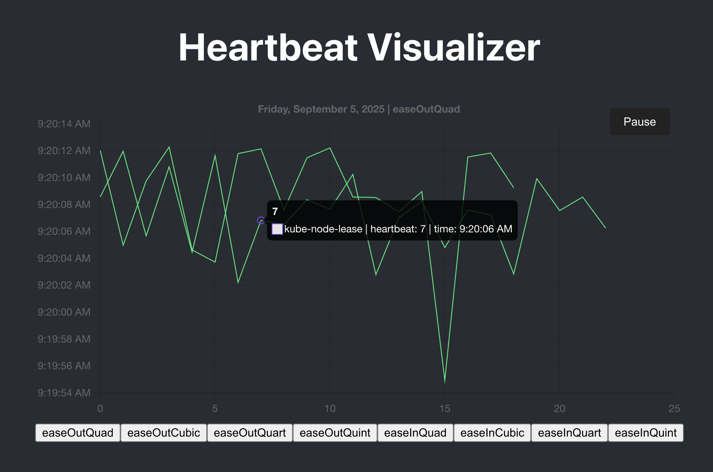
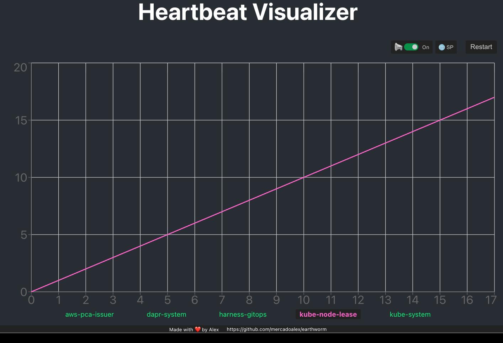
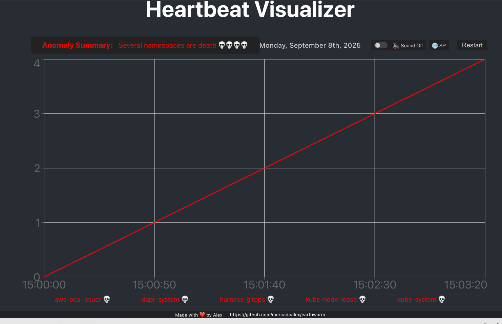
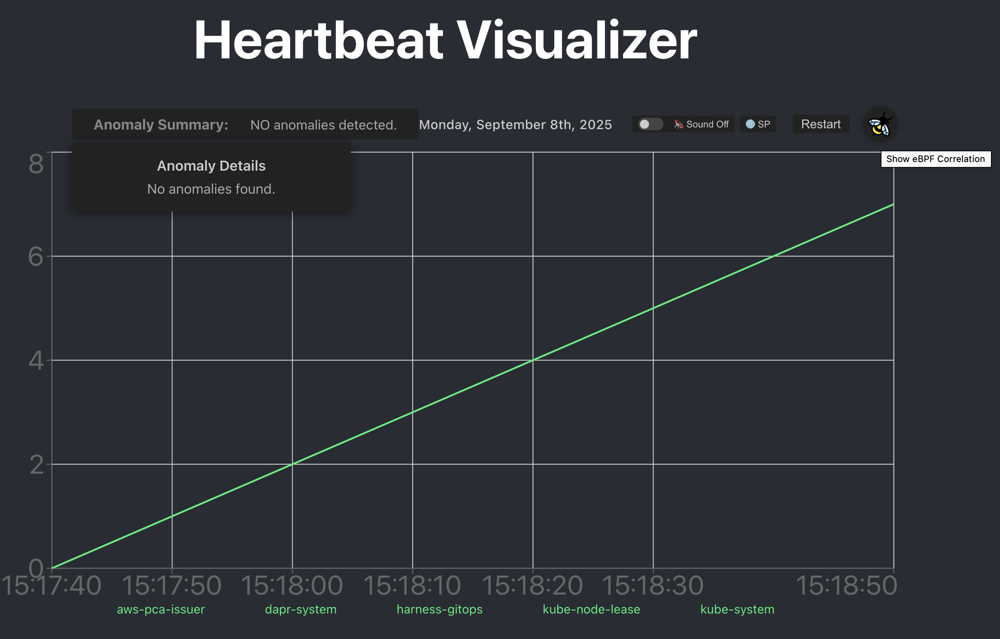
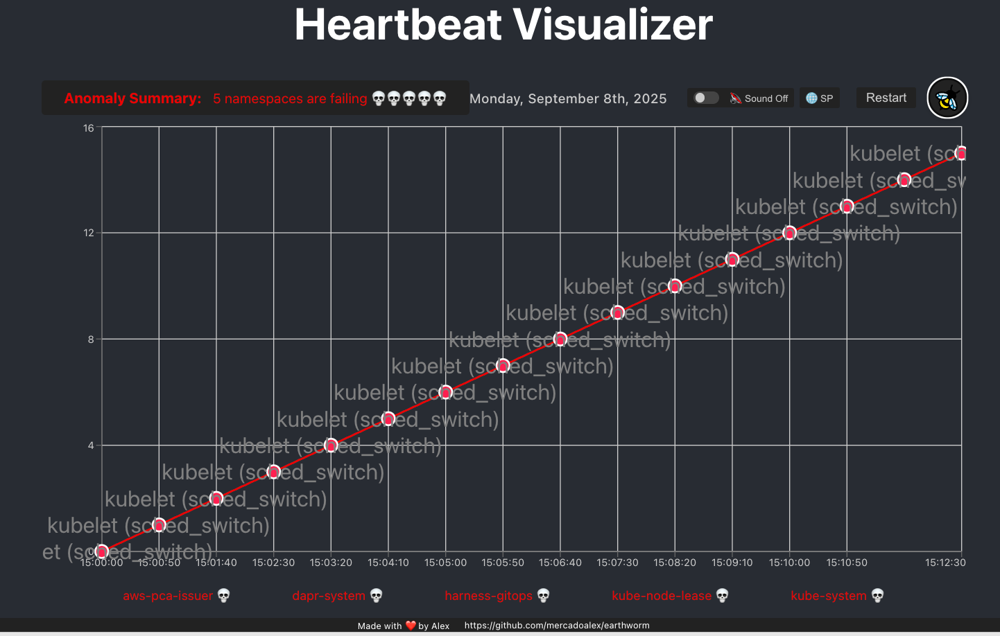
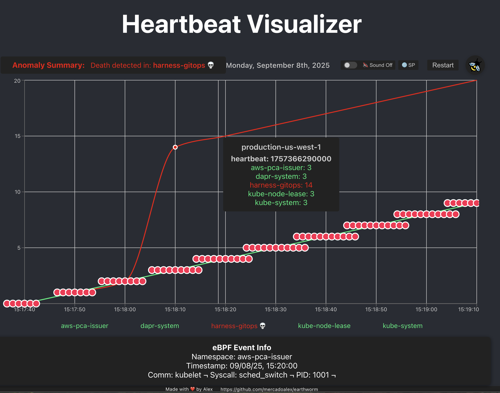

# Earthworm Project

<p align="center">
  
</p>

## Overview
The Earthworm project is designed to monitor the heartbeat signals of Kubernetes clusters using eBPF (Extended Berkeley Packet Filter) technology. The project visualizes this heartbeat data in a web-based interface, resembling a cardiogram, allowing users to monitor the health of their Kubernetes environments effectively. The name "Earthworm" symbolizes the project's ability to manage multiple "hearts" (Kubernetes nodes ) simultaneously.

## Kubernetes and Kernel version
This project is designed to support Kubernetes v1.20 and later, as these versions provide stable APIs and features required for heartbeat monitoring and eBPF integration.
For optimal results, use a recent Kubernetes release and ensure your nodes run a Linux kernel version 5.4 or newer (for optimal eBPF support).

## Project Structure
The project is organized into several directories, each serving a specific purpose:

- **src/agent**: eBPF agent for kernel-level observability (cgroup resolution, probe management, event codec).
- **src/ebpf**: eBPF C programs for heartbeat interception, process monitoring, syscall tracing, and network probes.
- **src/kubernetes**: Go client that watches Lease objects, correlates eBPF events, and supports simulation mode for generating realistic data.
- **src/server**: Go HTTP server with WebSocket streaming, pluggable storage (in-memory or Redis), anomaly detection, alerting, causal chain analysis, and prediction.
- **src/types**: Shared TypeScript types and interfaces.
- **src/heartbeat-visualizer**: React + TypeScript cardiogram-style visualizer with multiple views (line chart, heatmap, timeline, histogram, node table), zoom/pan, multi-cluster support, and real-time WebSocket updates.

```
earthworm/
├── README.md
├── # Changelog
├── .gitignore
├── deploy/                            # Docker and Helm deployment configs
│   ├── docker/
│   └── helm/earthworm/
├── src/
│   ├── agent/                         # eBPF kernel observability agent
│   │   ├── main.go
│   │   ├── event.go                   # Kernel event types
│   │   ├── cgroup_resolver.go         # Cgroup-to-pod resolution
│   │   ├── probe_manager.go           # eBPF probe lifecycle
│   │   └── *_test.go                  # Unit tests
│   ├── ebpf/                          # eBPF C programs
│   │   ├── heartbeat.c
│   │   ├── process_monitor.c
│   │   ├── syscall_tracer.c
│   │   └── network_probe.c
│   ├── kubernetes/                    # Kubernetes client
│   │   ├── monitor.go                 # Lease monitoring
│   │   ├── handle_ebpf.go            # eBPF event correlation
│   │   ├── simulation.go             # Realistic data simulation
│   │   └── *_test.go                 # Unit + property tests
│   ├── server/                        # Go HTTP + WebSocket server
│   │   ├── main.go                    # Server entry point
│   │   ├── config.go                  # Environment-based config
│   │   ├── store.go                   # Storage interface + MemoryStore
│   │   ├── redis_store.go            # Redis storage implementation
│   │   ├── ws.go                      # WebSocket hub + broadcast
│   │   ├── anomaly.go                # Anomaly detection + Alert types
│   │   ├── alert.go                   # Alert dispatcher (webhook + WS)
│   │   ├── middleware.go             # Logging middleware
│   │   ├── causal_chain.go           # Causal chain analysis
│   │   ├── prediction.go             # Predictive alerting
│   │   └── *_test.go                 # Unit, property, and integration tests
│   ├── types/
│   │   └── index.ts                   # Shared TypeScript types
│   ├── heartbeat-visualizer/          # React + TypeScript UI
│   │   ├── src/
│   │   │   ├── App.tsx                # Main app with cluster selector
│   │   │   ├── HeartbeatChart.tsx     # Cardiogram chart with zoom/pan
│   │   │   ├── ChartControls.tsx      # Sound, language, eBPF toggles
│   │   │   ├── ClusterSelector.tsx    # Multi-cluster tab selector
│   │   │   ├── ViewSelector.tsx       # View mode switcher
│   │   │   ├── LiveActivityPanel.tsx  # Real-time event feed
│   │   │   ├── Footer.tsx
│   │   │   ├── config.ts             # Centralized configuration
│   │   │   ├── parseLeases.ts        # YAML/JSON lease parser + serializer
│   │   │   ├── hooks/                # Custom React hooks
│   │   │   │   ├── useHeartbeatData.ts
│   │   │   │   ├── useEbpfData.ts
│   │   │   │   └── useWebSocket.ts   # WebSocket with exponential backoff
│   │   │   ├── services/
│   │   │   │   └── dataService.ts    # HTTP data fetching
│   │   │   ├── utils/                # Shared utilities
│   │   │   │   ├── chartUtils.ts     # hasWarning, hasDeath, getAnomalies
│   │   │   │   └── *.ts
│   │   │   ├── views/                # Alternative visualization views
│   │   │   │   ├── HeatmapView.tsx
│   │   │   │   ├── TimelineView.tsx
│   │   │   │   ├── HistogramView.tsx
│   │   │   │   └── NodeTable.tsx
│   │   │   ├── components/
│   │   │   │   └── AnomalyBadge.tsx
│   │   │   ├── contexts/
│   │   │   │   └── ViewContext.tsx    # Shared zoom/pan state
│   │   │   ├── types/
│   │   │   │   └── heartbeat.ts      # TypeScript interfaces
│   │   │   └── *.test.ts(x)          # Unit, property, and E2E tests
│   │   └── tsconfig.json             # TypeScript strict mode
│   └── leases.yaml                    # Raw heartbeat lease data
├── package.json
├── tsconfig.json
├── go.mod
└── go.sum
```


## Getting Started

Notice:  At this moment we are using only mock data (leases.json) from both sources Otel and eBPF.

### Prerequisites
- Go (version 1.16 or later)
- Node.js (version 14 or later)
- Kubernetes cluster (for production; mock data works without one)

### Installation
1. Clone the repository:
   ```bash
   git clone https://github.com/mercadoalex/earthworm.git
   cd earthworm
   ```

2. Install Go dependencies:
   ```bash
   cd src/server
   go mod tidy
   ```

3. Install Node.js dependencies:
   ```bash
   cd src/heartbeat-visualizer
   npm install
   ```

### Running the Project
1. **Start the Go server** (uses mock data by default):
   ```bash
   cd src/server
   go run .
   ```

2. **Start the React visualizer**:
   ```bash
   cd src/heartbeat-visualizer
   npm start
   ```

   The visualizer opens at `http://localhost:3000` and connects to the Go server at `http://localhost:8080`.

3. **Run the eBPF program** (optional, requires Linux 5.8+ with CAP_BPF):
   - Compile and load the eBPF programs in `src/ebpf/` using `clang` and `bpftool`.

### Server Configuration

The Go server reads configuration from environment variables:

| Variable | Default | Description |
|---|---|---|
| `EARTHWORM_PORT` | `8080` | Server port |
| `EARTHWORM_LOG_FILE` | `earthworm.log` | Log file path |
| `EARTHWORM_CORS_ORIGINS` | `*` | Comma-separated CORS origins |
| `EARTHWORM_STORE` | `memory` | Storage backend (`memory` or `redis`) |
| `EARTHWORM_REDIS_ADDR` | `localhost:6379` | Redis address (when store=redis) |
| `EARTHWORM_WARNING_THRESHOLD` | `10` | Warning gap threshold (seconds) |
| `EARTHWORM_CRITICAL_THRESHOLD` | `40` | Critical gap threshold (seconds) |
| `EARTHWORM_WEBHOOK_URL` | _(empty)_ | Webhook URL for alert delivery |

Example:
```bash
EARTHWORM_PORT=9090 EARTHWORM_STORE=redis EARTHWORM_REDIS_ADDR=redis.local:6379 go run .
```

### Running Tests

```bash
# Go tests (server, kubernetes, agent)
go test ./...

# React tests (visualizer)
cd src/heartbeat-visualizer
npx react-scripts test --watchAll=false
```

### Architecture
The Earthworm project consists of the following components:
- **eBPF Programs**: Intercept heartbeat signals, monitor processes, trace syscalls, and probe network activity on Kubernetes nodes.
- **eBPF Agent**: Manages probe lifecycle, resolves cgroups to pods, and encodes kernel events for the server.
- **Kubernetes Monitor**: Watches Lease objects and Pod events, correlates eBPF data, and supports simulation mode for generating realistic test data.
- **Go Server**: Receives heartbeat data via REST API, broadcasts events via WebSocket (`/ws/heartbeats`), detects anomalies against configurable thresholds, dispatches alerts via webhook and WebSocket, and supports pluggable storage (in-memory default, Redis optional).
- **React Visualizer**: TypeScript-based cardiogram UI with multiple views (line chart, heatmap, timeline, histogram, node table), zoom/pan, multi-cluster support, real-time WebSocket updates, toast alert notifications, and accessible keyboard navigation.


### Deployment

The delivery mechanism for the eBPF program will use a **Kubernetes DaemonSet**. This ensures that the eBPF loader and monitoring agent run on every node in the cluster, allowing Earthworm to intercept heartbeat signals from all nodes efficiently. The DaemonSet can be packaged and deployed using a Helm chart for easy installation and management.


## Conclusion
The Earthworm project provides a comprehensive solution for monitoring Kubernetes cluster health through innovative use of eBPF technology. By visualizing heartbeat data, users can gain insights into the performance and reliability of their Kubernetes environments. This project serves as an educational resource for understanding eBPF, Kubernetes, and modern web application development.

## License
This project is licensed under the MIT License - see the [LICENSE](LICENSE) file for details.

# Preview


## Author
Alejandro Mercado Peña mercadoalex[at]gmail.com
# Update

# Anomalies detected

# Anomalies detail

# eBPF power unleashed


